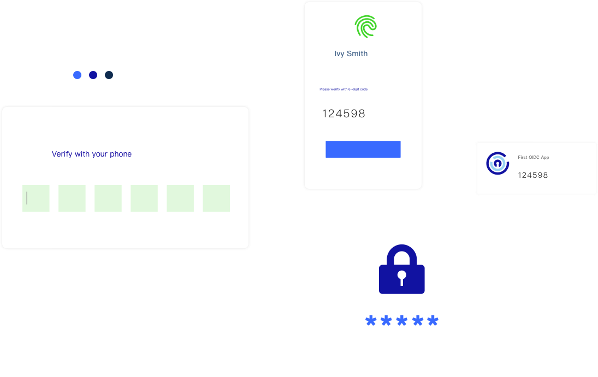

# What is Multi-Factor Authentication (MFA)?

<LastUpdated/>

Multi-Factor Authentication (MFA) is a very simple security authentication technique that can add an extra layer of protection in addition to the user name and password. After enabling MFA, when users perform operations, in addition to providing the user name and password (first authentication), they also need to perform a second authentication. MFA will provide more information for your account and resources with higher security protection.

For companies, the cost of data breach is getting worse. On the one hand, companies will be punished by regulatory authority. For example, British Airways was fined 204 million euros by the Information Commissioner's Office (ICO) for data breaches. On the other hand, once data leakage occurs, it will not only make the company lose the trust of customers and users, but also affect the company's long-term development.

Therefore, the use of MFA has become a basic solution for enterprises to prevent data leakage. MFA requires users to use at least two factors to verify their identity, and only after passing the verification can they access applications, which is rapidly spreading among enterprises.

Statistics also prove the effectiveness of MFA. At the end of last year, LastPass conducted a survey of 47,000 companies and found that 57% of companies worldwide are currently using MFA, an increase of 12% over the previous year. Earlier this year, Microsoft reported that 99.9% of its tracked offending accounts did not use MFA.

## The core functions of Approw MFA

-   Approw guarantees business security through multiple authentication methods;
-   [Customize the authentication process](/guides/pipeline/), which is simple with one-touch open;
-   Support environmental data report for equipments and multi-dimensional analysis of security levels;
-   Support configuration strategy to achieve environmental risk self-adaptation;
-   Suitable for [privilege control in APP](/guides/access-control/);
-   Integrated into the [universal login component (Guard)](/reference/ui-components/) by default;
-   [User data management, operation log query](/guides/audit/);
-   Provide [SDK and open interfaces](/reference/) to help developers quickly call related capabilities(functions?) and build custom user management pages.

## The methods of MFA

Approw provides multiple authentication methods to improve enterprise identity security.

### Phone token

With strong dynamic OTP password verification, it helps protect account security and avoid malicious attacks.

### SMS/Email verification code

-   Easy to use
-   Convenient
-   Improve login security

### Compatible with third-party authenticators

Compatible with third-party authenticators, including but not limited to:

-   Google Authenticator
-   Microsoft Authenticator

### Biometrics

Fingerprint/face, as key factors of human body characteristics, is widely used in the field of security authentication.

### Graphic lock

-   Simple and easy to use;
-   Security can be enhanced with more complex graphics.

## Advantages of Approw MFA

### Developer-friendly

Provides an out-of-the-box SDK to help end-to-end developers to quickly implement MFA.

-   Support multiple terminals: [Web](/reference/ui-components/)、[iOS](/reference/sdk-for-swift.md)、[Android](/reference/sdk-for-android.md);
-   Built-in multiple MFA terminal components, such as OTP, verification code, fingerprint unlocking, facial recognition, graphic lock, etc.;
-   Only need to call a method to start the MFA certification component, get the certification result, and complete the certification process.

### Report customized data

Report customized data, participate in the process and initiate decision-making, and cover more complex and refined scenarios.

-   Support data reporting during [Approw SDK](/reference/) initialization;
-   Support regular data reporting;
-   Support active data reporting when the application is running;

### Strategy-based MFA

The trigger conditions of MFA are based on custom strategies, and the strategy system is simple, efficient, complete and flexible.

-   Simple: If you don't want to configure a complicated strategy, you can use the default security strategy or default conditions;
-   Efficient: multi-factor authentication is immediately aroused under millisecond-level judgment strategy with a good user interface;
-   Completed: The strategy is described based on function expressions, and developers can obtain enough information (including but not limited to user information, equipment, network, location, behavior, custom report data, etc.) to think strategy and logic;
-   Flexible: Judgment can be made based on multiple methods at the same time.

### Simple configuration

Based on a friendly user interface, quickly configure multi-factor authentication for specific applications.

-   One-click turn on/off multi-factor authentication;
-   One-click to enable the default security policy, without having to understand the policy configuration, can also greatly improve the security of the application;
-   Dozens of default, important and commonly used strategies to fit conditions, which will take effect upon selection and can be used by non-engineers.

## Adaptive MFA

Compared with traditional MFA, "adaptive" MFA can choose to apply different MFA methods according to the current security situation, which ensures security while also taking into account the user experience. "Adaptive" MFA provides a more flexible and intelligent verification strategy.

When the user is in the authentication process, the "adaptive" MFA generates multiple "key elements" for the currently logged-in user:

-   User attributes: such as user name, password, user identity and other attributes and information of the user;
-   Location awareness: Location awareness is divided into the virtual location (IP address) and physical location (country, region, etc.);
-   Request source: Judge the source of the current user's request, such as hardware device information, the user's current system, etc.;
-   Biometrics: Use the user's biological information for identification, such as fingerprint information, face recognition, etc.;
-   Behavior analysis: A series of user behaviors such as whether it comes from a frequently used login location, whether the wrong password is entered multiple times, and the user's previous operation records.
