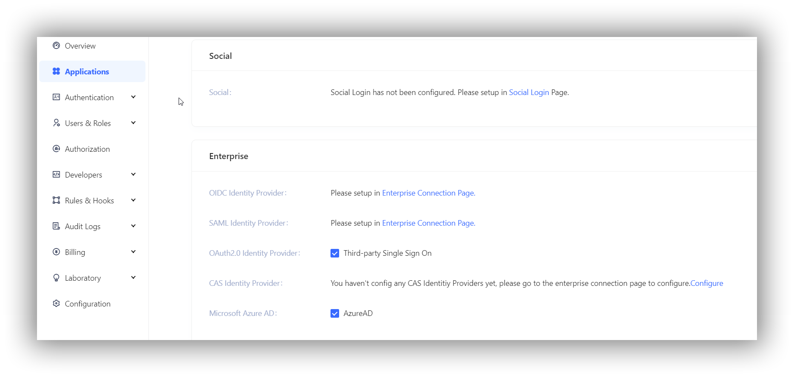
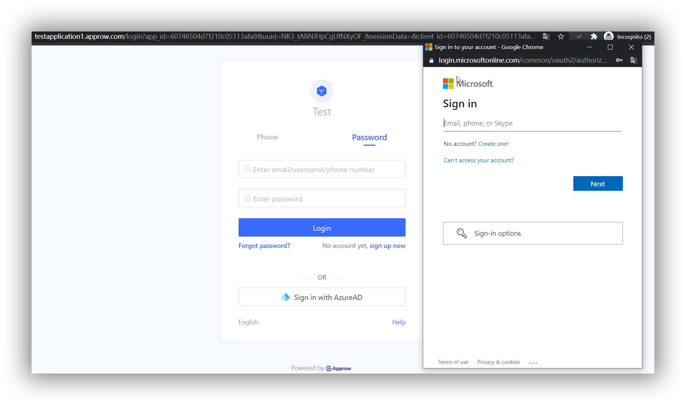

<IntegrationDetailCard title="Use Azure AD to Login">

## Enable Azure AD Connection for Your Application

You can enable IdP connection with Azure AD for your application in the **Configure Login Sheet** of **Application Details** tag.

<!--  -->

## Use Azure AD to Login

Click **Experience Login** button on top right and go to the login page, you can see there is a **Use Azure AD to Login** button.

<!-- </img> -->
</img>

When you click this button you will be redirected to Azure AD login page.

<!--  -->

After inputting the correct username and password, you will see a notice that says you have logged in successfully.

<!--  -->

User's profile in Azure AD will also be synchronized to Approw user pool.

<!--  -->

</IntegrationDetailCard>