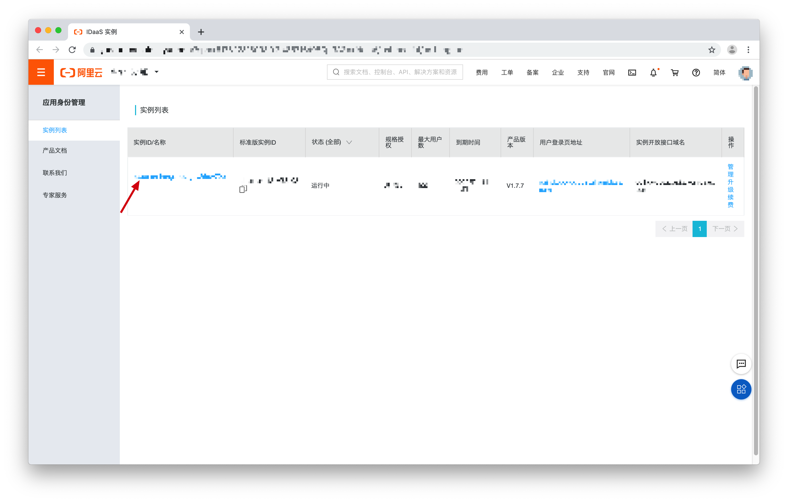
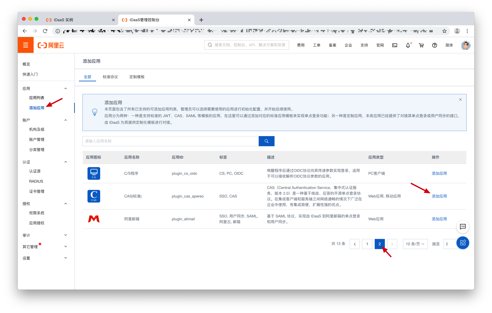
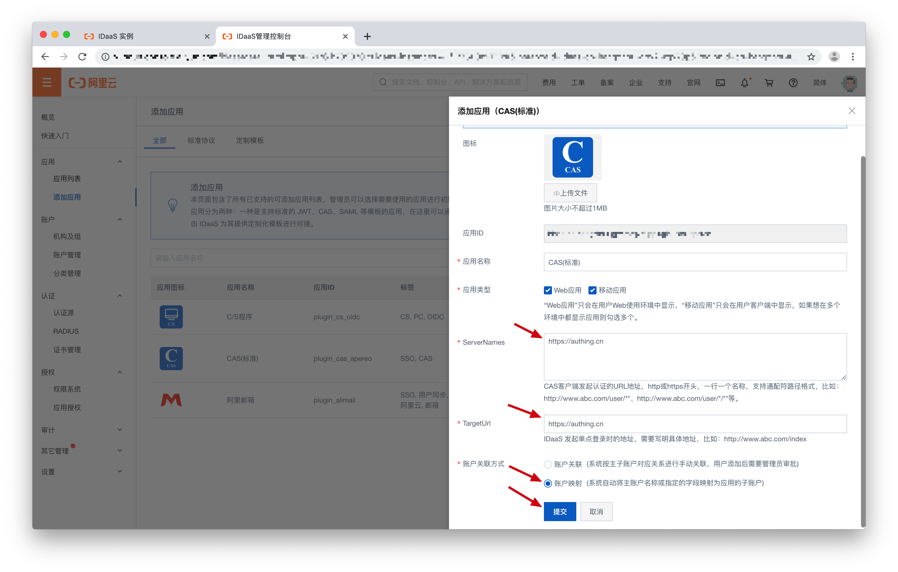
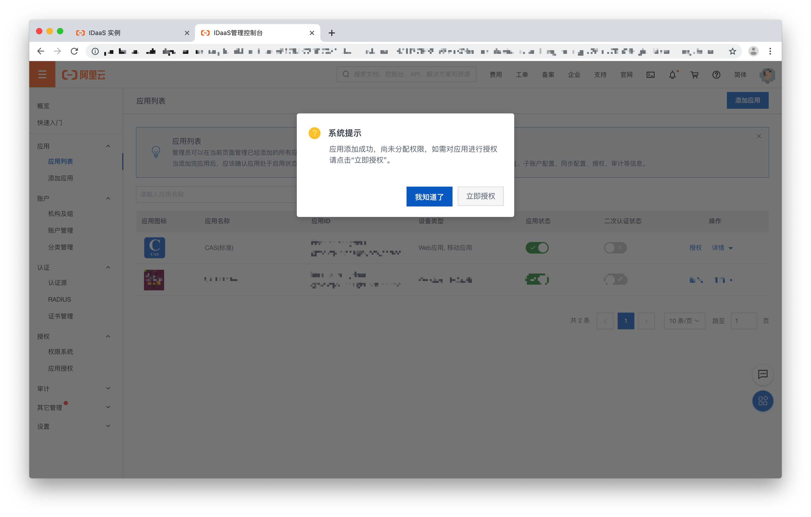
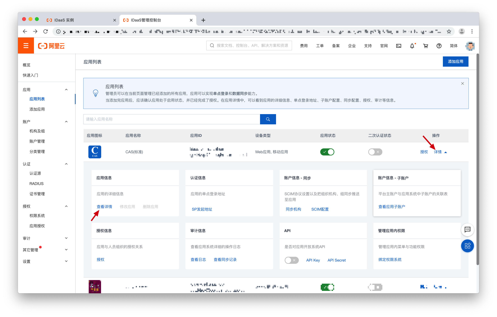
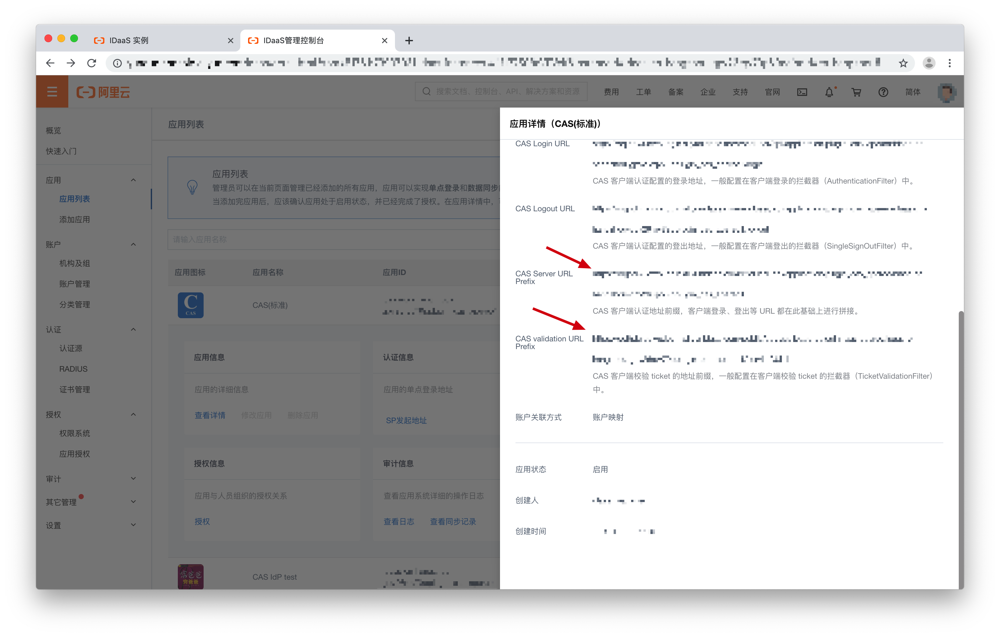

<IntegrationDetailCard title="Create CAS IdP">

You need to sign up in CAS IdP and gather required information. Here, we are using Alibaba Cloud CAS IdP as the example.
You need to subscribe Alibaba Cloud first. In Identity console, find your instnace and enter the detailed page by clicking the name.

On the left side, go to Applications -> Add Applications. You need to find "CAS (standard)" on the second page. Then Click "Add Application".

In the configuration window, fill in the ServerNames and the TargetURL. You can use any name and URL here and we will modify these parts after finishing other Approw configurations. For account link method, please choose Account Mapping. After you finish all parts, click "submit". 

Successfully create.

Find your application, click Detail -> More Details. As the image shown below:

You need to record the **CAS Server URL Prefix** and the **CAS validation URL Prefix** for following {{$localeConfig.brandName}} configuration.

</IntegrationDetailCard>
