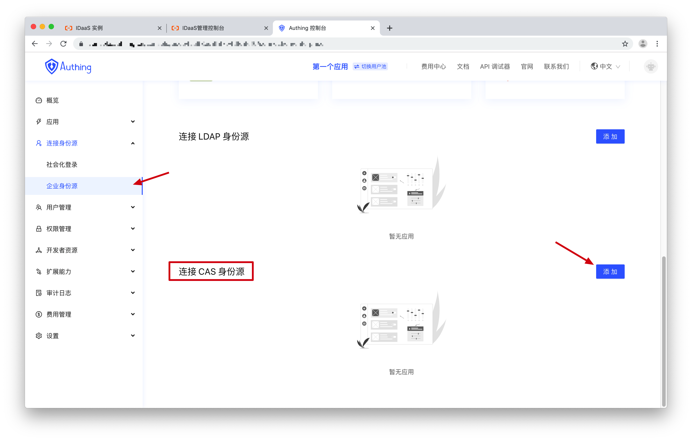
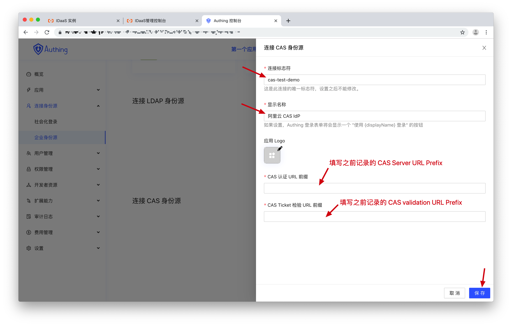
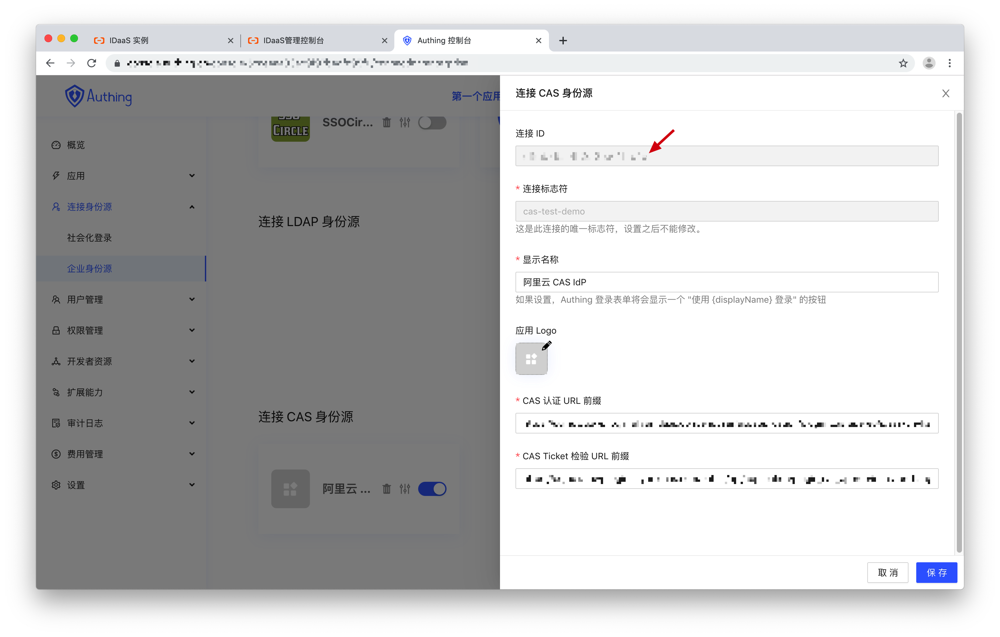
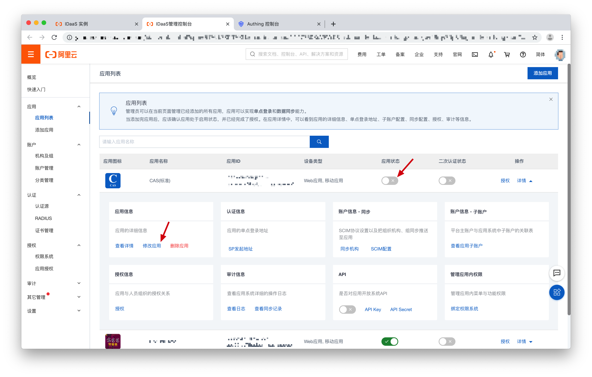
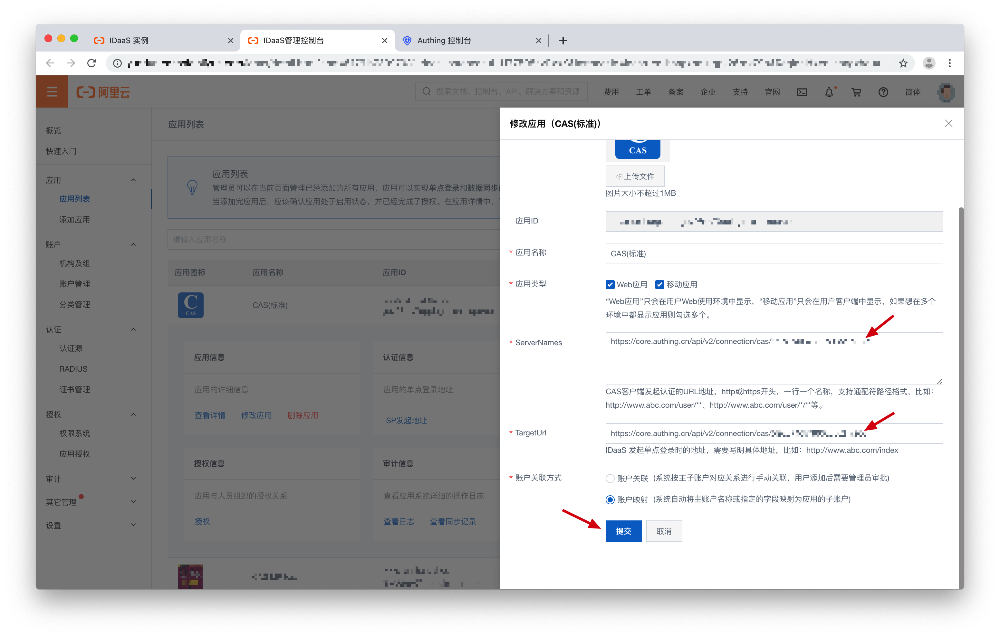

<IntegrationDetailCard :title="`在 ${$localeConfig.brandName} 填入 CAS Identity Provider 配置`">

你需要在 {{$localeConfig.brandName}} 中添加你在上一步创建的应用的配置：
刚刚我们在阿里云申请了一个 CAS IdP，接下来需要在 {{$localeConfig.brandName}} 创建一个 CAS 连接。

进入 **{{$localeConfig.brandName}} 控制台** > **连接身份源** > **企业身份源**，在下方找到「连接 CAS 身份源」，点击「添加」按钮。

填写一个连接标识符，展示名称，将之前记录的 **CAS Server URL Prefix** 和 **CAS validation URL Prefix** 填写到相应位置，最后点击保存，如下图所示：

找到刚刚创建的 CAS 连接，点击编辑按钮，记录下**连接 ID**。

## 配置 CAS IdP

现在我们回到阿里云 CAS 应用配置，修改之前随意填写的两个 URL。先将应用禁用，然后点击「修改应用」。

将 `https://core.authing.cn/api/v2/connection/cas/<应用 ID>` 填入到 **ServerNames** 和 **TargetUrl** 中，点击「提交」，最后不要忘记打开应用开关，启用应用。

到此配置过程全部完成，接下来我们测试连接。

</IntegrationDetailCard>