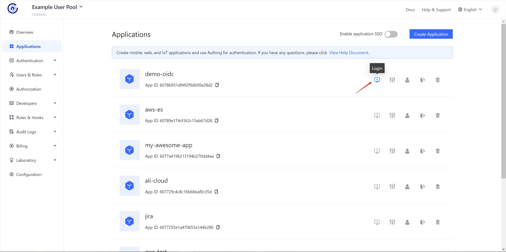
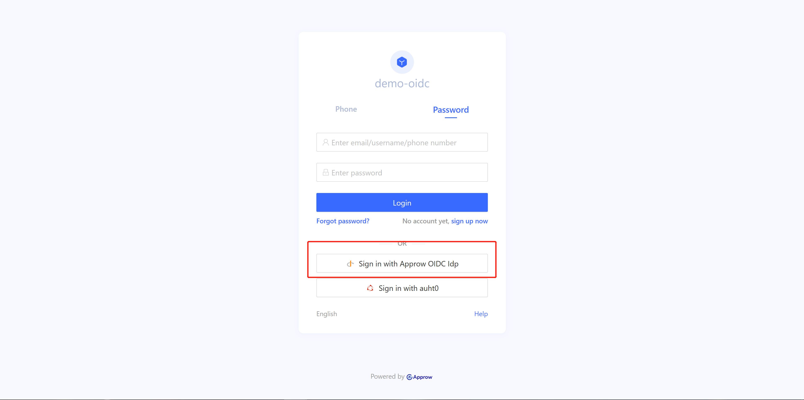
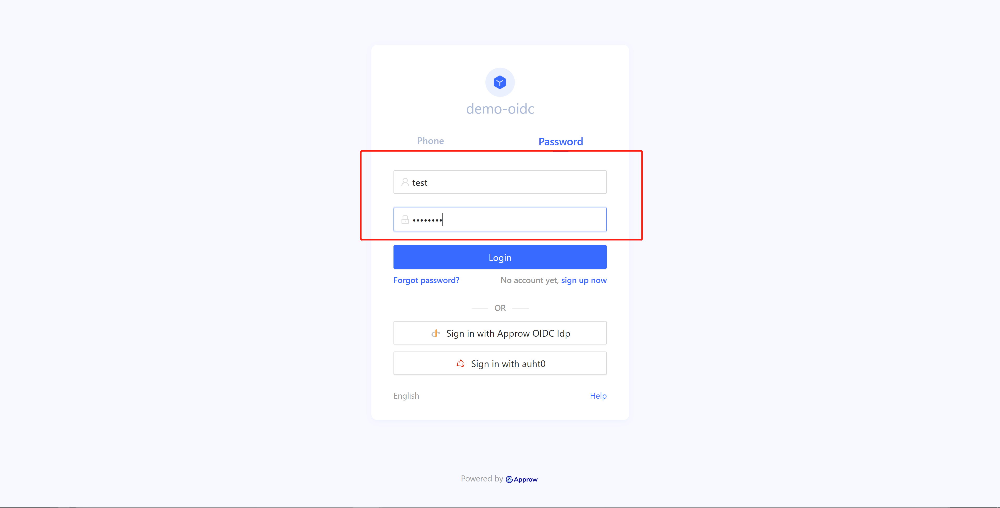
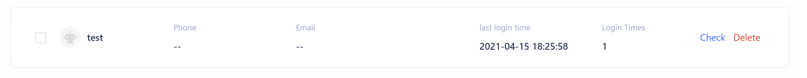

<IntegrationDetailCard title="Login via OIDC">

In the Applications page, please click Login:



In the Login UI, there is a button displayed as "Login via {Display Name}".



Click the button to Login, the browser will pop a new window to OIDC IdP Login UI. Here we use Approw OIDC IdP.



Login via OIDC Login UI. Here we use `test@approw.com` as user. After successfull Login, pop up window will close and the user will be redirected to Approw. In the meantime, user has been synchronized to Approw User Pool.



## Test by API

If you want use your own Login UI for OIDC IdP, you can use API.

### POST `start-interaction`

<ApiMethodSpec method="post" host="https://core.approw.com" path="/api/v2/connections/oidc/start-interaction">
<template slot="description">

When the user is redirected from OIDC IdP to Approw server, Approw use `state` in callback to determine the user should be in which User Pool. So we need to link state with the User Pool.

</template>
<template slot="bodyParams">
<ApiMethodParam name="state" type="string" description="Random String, use for futher OIDC request" required/>
<ApiMethodParam name="userPoolId" type="string" description="User Pool Id" required/>
<ApiMethodParam name="returnTo" type="string" description="Callback URL" required/>
</template>
<template slot="response">
<ApiMethodResponse httpCode="200">

```js
{
    code: 200,
    message: "ok"
}
```

</ApiMethodResponse>
</template>
</ApiMethodSpec>

### OIDC IdP Login Request

::: hint-info
Call Interface Method may vary depends on OIDC IdP. Here we use Approw OIDC IdP as an example.
**Be aware: state must be same with previous state**.
:::

<ApiMethodSpec method="get" host="https://<domain name>.approw.com" path="/oidc/auth" summary=" " description="Login request need an URL and parameter below: ">
<template slot="queryParams">
<ApiMethodParam name="client_id" type="string" description="Client ID" required/>
<ApiMethodParam name="redirect_uri" type="string" description=" " required>

The Redirect URL. After successful login, the OP will send Authorization code to this URL by query. This value is required in configuration.

</ApiMethodParam>
<ApiMethodParam name="scope" type="string" required>

The request information from the client, the openid must be included. You need to separate each scope with spaces. The id_token will include those scope information after decrypt.

</ApiMethodParam>
<ApiMethodParam name="response_type" type="string" required>

The response type, could be: code, id_token, id_token token, code id_token, code token, code id_token token. after successful login, the OP is required to return corresponding information according to this parameter. If the code is included, the OP will return Authoriztion code. If the id_token is included, the OP will return id_token. If the token is included, the OP will return access_token.

</ApiMethodParam>
<ApiMethodParam name="prompt" type="string">

Could be none, login, consent or select_account. It is used to determine interactive mode with OP. Remeber, if you need refresh_token, the value must be consent.

</ApiMethodParam>
<ApiMethodParam name="state" type="string" required>

A random string. This string is used for preventing the OIDC flow from the CSRF attack. If the state in response is not same as before which means the flow may be attacked.

</ApiMethodParam>

<ApiMethodParam name="nonce" type="string" description="Random String, In case of Replay attack."/>
</template>

</ApiMethodSpec>

### Retrive User Information

After successful login, will be redirect to Approw server. Then Approw will redirect to `returnTo` with user inforamtion and Get method

| parameter | Explaination                           |
| :-------- | :------------------------------------- |
| code      | indicating success of failure          |
| message   | message                                |
| data      | userInfo，if code is 200, return value |

::: hint-warning
Some browsers may report 404 if the URL is too long. Please refer to [StackOverflow page](https://stackoverflow.com/questions/28681366/in-asp-net-mvc-would-a-querystring-too-long-result-in-404-file-not-found-error/28681600).
:::

Here is the JavaScript to retrive user info:

```js
// Get URL parameters
function getQueryString(name) {
	var reg = new RegExp("(^|&)" + name + "=([^&]*)(&|$)", "i");
	var r = window.location.search.substr(1).match(reg);
	if (r != null) {
		return unescape(r[2]);
	}
	return null;
}

// Change to Int
const code = parseInt(getQueryString("code"));

if (code !== 200) {
	// Error
	const errorMsg = getQueryString("message");
	// Show errorMsg...
} else {
	const userInfo = getQueryString("data");

	// Store token in localStorage
	// recommand use Token in futher request，and validate Token in Backend
	localStorage.setItem("token", userInfo.token);
}
```

</IntegrationDetailCard>
