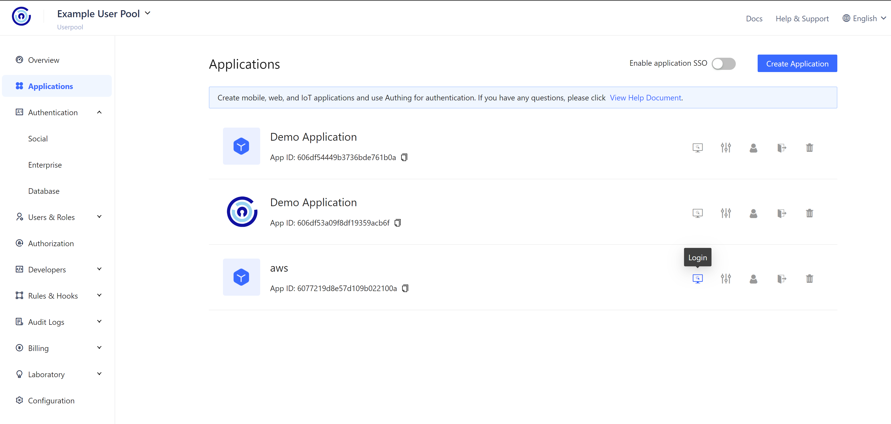
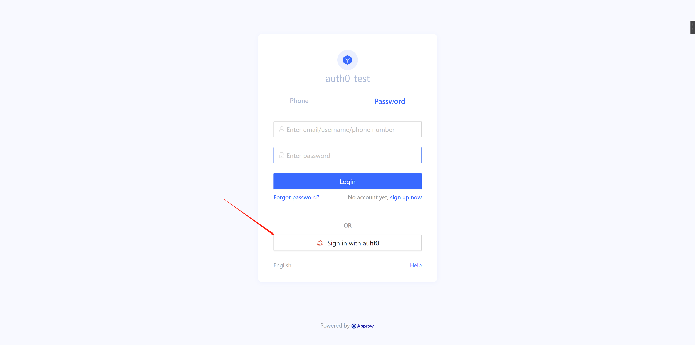
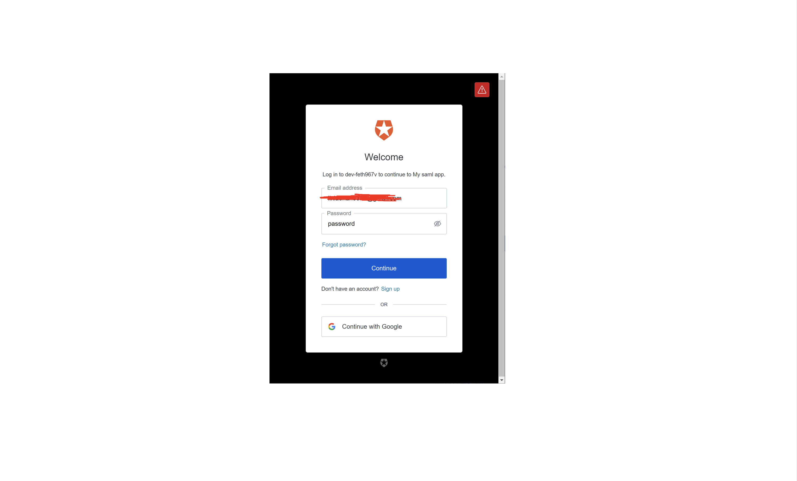
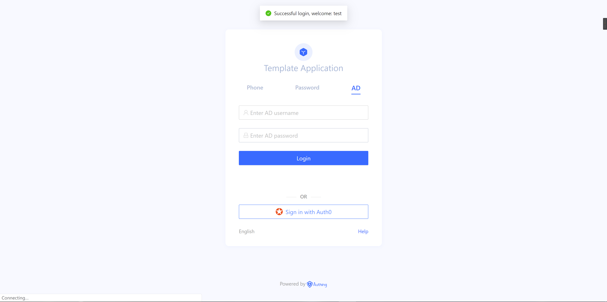
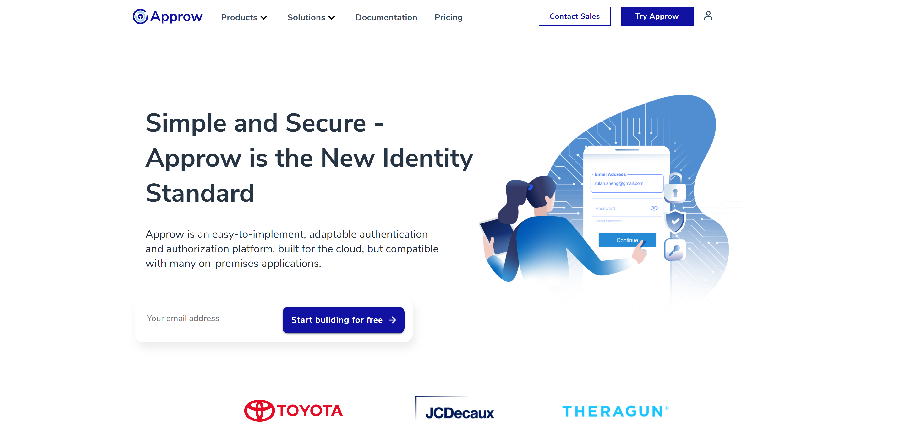

<IntegrationDetailCard title="Login via SAML IdP">

In Applications page, please click Login.
<!--png should be lower case -->

In the Login UI, you can choose login via SAML IdP.

In the pop up window, login with your SAML IdP.

Successful Login.

Then you will be redirected to the redirect URL with Authorization code and other information.

You can require access_token and other user information with Authorization code. Please refer to [Authorization code flow]().

</IntegrationDetailCard>
