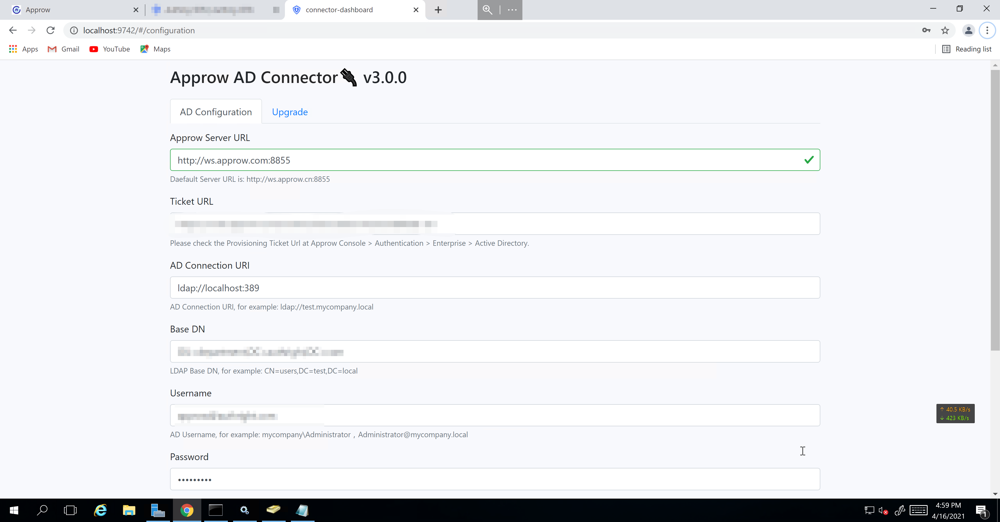

<IntegrationDetailCard title="Install AD Connector on Windows Server">

Go to [Approw console ](https://console.approw.com/console/userpool) > **Connect IdP**/**Enterprise IdP**, and find **Connect Windows AD** as the figure shows.

::: img-description
Create AD Connection
:::

You need to complete the following fields:

- **Connection Identifier**: The identifier for this connection and can not be changed after configuration.
- **Display Name**: The Approw login sheet will use a button that shows "Use {Display Name} Login" if this field is set.
- **Application Logo**: The Approw login sheet will put this logo on the button that shows "Use {Display Name} Login" if this field is set. The size of the logo is 20*20.

After that click "**Save**" button to create the application. You will get a **Provisioning Ticket Url** after successful creation which will be used in the following steps.

Then you need to enable Windows AD connection for your application:

#### Run {{$localeConfig.brandName}} AD Connector on Windows Server

You need to satisfy following requirements to install {{$localeConfig.brandName}} AD Connector:

- You are using Windows Server.
- There is an Active Directory is installed on the server.
- The machine where {{$localeConfig.brandName}} AD Connector is running could connect Active Directory.
- An admin account which has the read/write permission of Active Directory.

First, you need to download the {{$localeConfig.brandName}} AD Connector, which is an executable file. This file needs to run on your Windows AD server and will connect with {{$localeConfig.brandName}}. The {{$localeConfig.brandName}} AD Connector needs to be installed on the **local area network of AD domain environment**, you don't have to install it on the server where Windows AD is running. You only need to ensure that {{$localeConfig.brandName}} AD Connector can visit AD user directory.

#### Install {{$localeConfig.brandName}} AD Connector

<!-- Click [here](https://download.approw.com/app/Approw-AD-Connector-latest.exe) to download the lateset version of Approw AD Connector. -->

Then upload the file on the machine in AD domain environment and start the installation process.

The system may throw an warning, please click "Still Run this Application".

Click "Next".

Accept all terms in the protocol and click "Next".

Choose the installation path of the software and click "Install".

Wait until the installation process is complete.

Click "Done" and then the command line window will show up. Wait unitl the instiallation process is complete.

There will be some error reports about missing dependents which can be ignored. When you see following window says the installation is complete, you can push any button to quit.

After that you can find ApprowADConnector in the Service Management window of Windows Server.

Open the browser and visit http://127.0.0.1:9742, you will see the following window.

Input your Provisioning Ticket Url, AD Server Connection Address(please use **http://ws.approw.com:8855**), Base DN, Admin User Name and Password. Then click "**Save**" button.

Click "Test Connection", if the following results shows up which means the connection succeed.

::: hint-info
If the connection test failed between Connector and Approw, please wait for a second. That is because the hand shaking between Connector and Approw is not complete caused by network delay.
:::

::: hint-info
If any error shows up about the AD, please check the connection of AD server and if the username/password are correct. 
:::

</IntegrationDetailCard>
