<IntegrationDetailCard title="Create a mobile application in the Apple Developer Center">

Before configuring Sign in with Apple social login in the {{$localeConfig.brandName}} console, you need to register your iOS in [Apple Developer Portal](https://developer.apple.com/account/#) application. After completing this operation, you can fill in the {{$localeConfig.brandName}} Dashboard configuration form with the ID and Secret obtained from Apple

#### get Team ID

Go to [Apple Developer Portal](https://developer.apple.com/account/#) - [Membership](https://developer.apple.com/account/#/membership)，mark down **Team ID**：

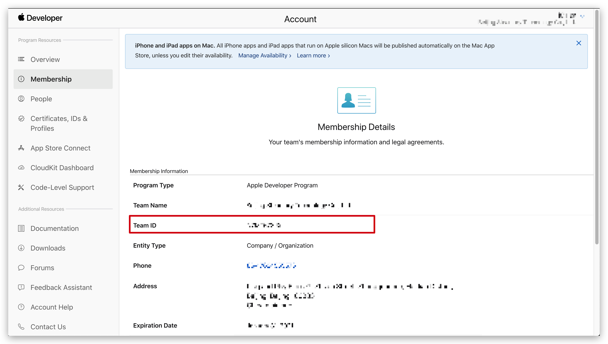

#### create an App ID

1. In Apple Developer Portal, **Certificates, IDs, & Profiles** > **Identifiers** page，click ➕ icon to create application：

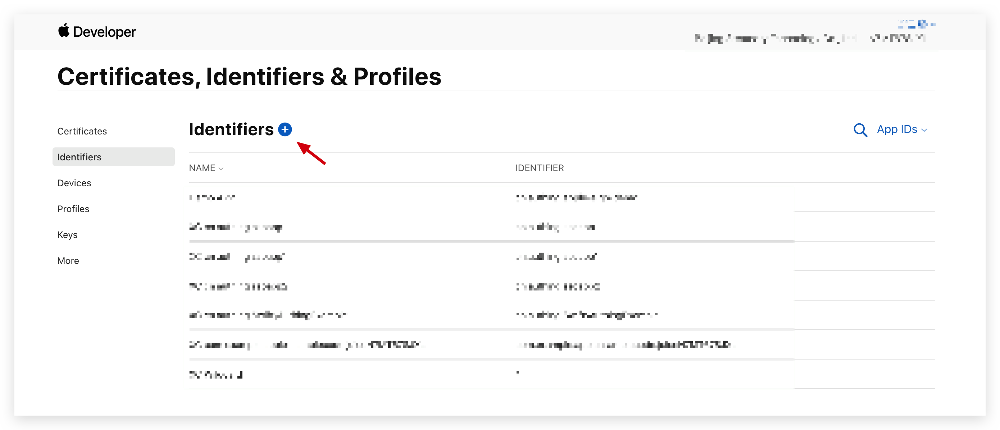.

2. Select **App IDs** and click the **Continue** button to continue:

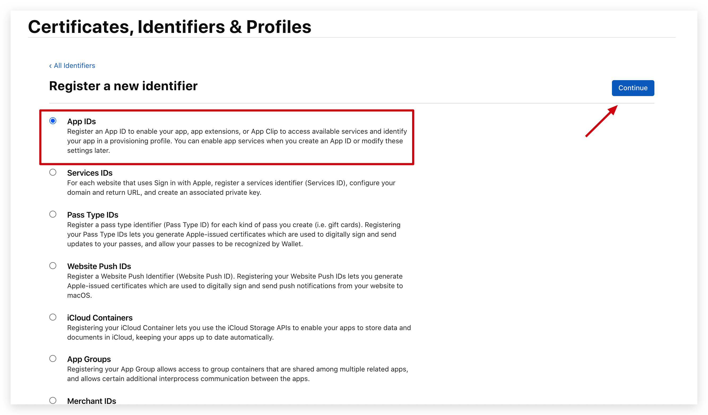

3. Select the application type of the format, and then click the **Continue** button to continue:

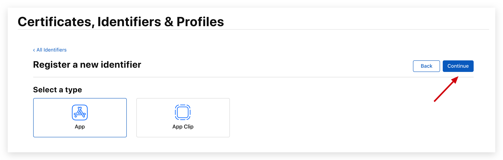

4. Fill in the application description and **Bundle ID**, record this **Bundle ID**:

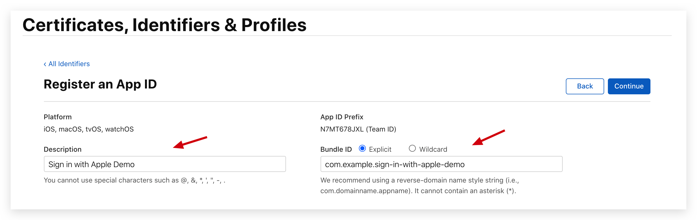

5. Swipe your browser to find Sign in with Apple below and check

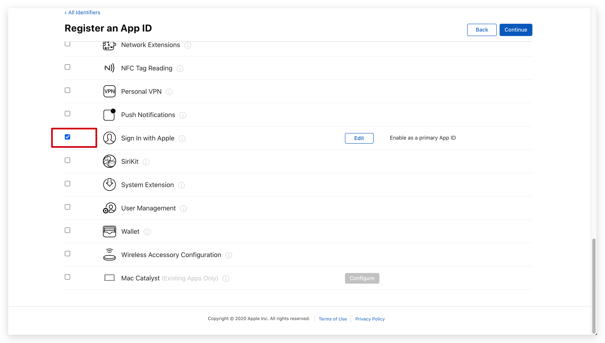

6. Finally, click the **Continue** button to create the application

#### create a Service ID

1. Back to **Certificates, IDs, & Profiles** click ➕ icon，choose **Services IDs** then click **Continue** button to continue

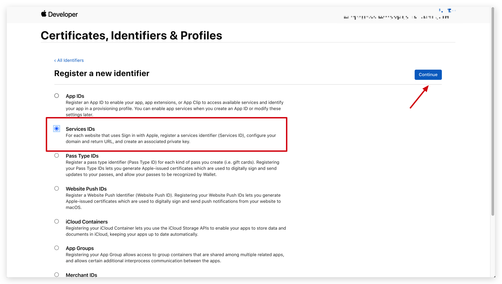

2. Fill in the description information and Identifier, and then click the **Continue** button to create the Service:
   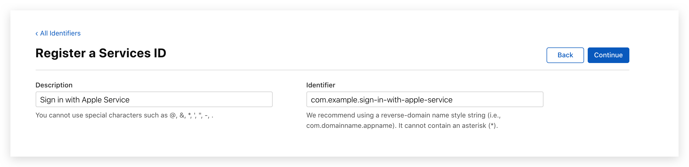

3. Find the Service you just created, select **Sign In with Apple**, and click **Configure**:
   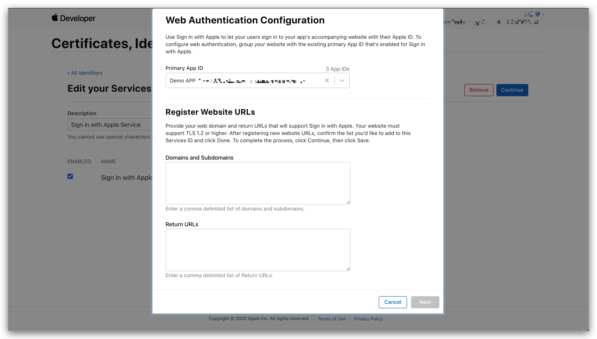

4. Fill in **Domains and Subdomains** and **Return URLs**:

-   **Domains and Subdomains** fill in **core.authing.cn**
-   **Return URLs** fill in `https://core.authing.cn/connection/social/apple/<YOUR_USERPOOL_ID>/callback`, replace `<YOUR_USERPOOL_ID>` with your user pool ID

5. click **Save**, **Continue**, then click **Register**.

6. mark down **Service ID**.

#### Config Signing Key

1. Back to **Certificates, IDs, & Profiles** page **Keys** click ➕ icon:

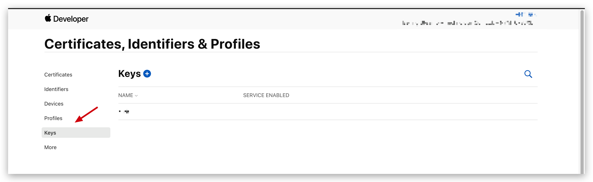

2. Enter the name and check **Sign in with Apple**, click **Configure**, make sure the selected **Primary App ID** is the one you just created:

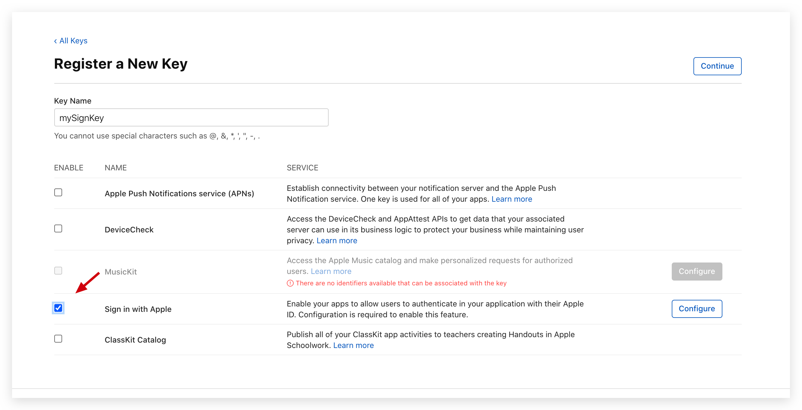

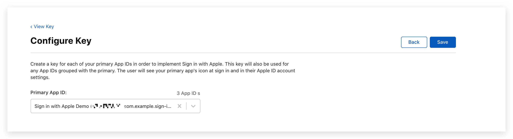

1. click **Save**, **Continue**, then click **Register**.

2. After creation, record the **Key ID**, and then click **Download** to download the key:

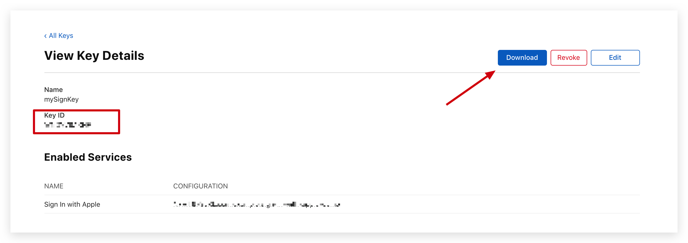

</IntegrationDetailCard>
