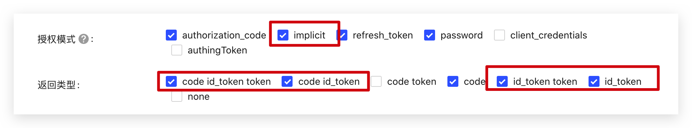

<IntegrationDetailCard :title="`Configur OIDC Client in {{$localeConfig.brandName}}`">

You need to configure the OIDC Client in {{$localeConfig.brandName}}

1. Access the Enterprice IdP configuration page in [{{$localeConfig.brandName}} Console](https://console.approw.com)
2. Locate **OIDC** IdP
3. Modify the following configuration settings:
  - **Link label**: Must be Identical
  - **Display Name**: will show a button name as "login via {Display Name}" on Approw Login UI
  - **Logo URL**: will  show the logo on Approw Login UI. Image size 20 \* 20
  - **Issuer URL**: Issuer URL from OIDC
  - **Client ID**: Client ID from OIDC
  - **Callback URL**: must be https://core.approw.com/connections/oidc/callback.
  - Click **Create**

There are two modes when integrating  OIDC IdP

- `Front Channel` : User information exchange only takes place in the browser. `response_mode=form_post` and `response_type=id_token`, make sure the `implicit` mode and `id_token` are enabled in your application.

- `Backend Channe`: User information exchange only takes place in the Approw server. `response_type=code`. Make sure the authorization_code is enabled and OIDC client secret is known.

4. Click **Save**

</IntegrationDetailCard>
