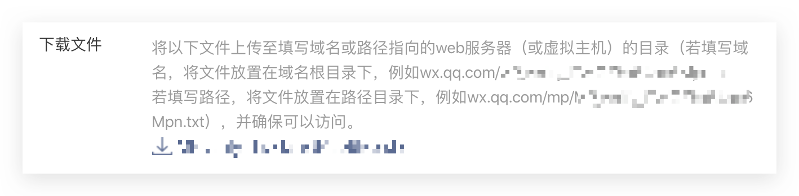

<IntegrationDetailCard :title="`在 ${$localeConfig.brandName} 填入微信移动应用配置`">

你需要在 {{$localeConfig.brandName}} 中添加你在上一步创建的应用的配置：

1. 在 [{{$localeConfig.brandName}} 控制台](https://console.authing.cn) 进入社会化登录配置页面。
2. 找到**微信网页授权**社会化登录。
3. 在配置表单中，填入以下配置：

出于安全验证考虑，微信服务器需要和 {{$localeConfig.brandName}} 服务器做一次请求验证，开发者需要下载 txt 文件，并记录 **文件名** 和 **文本内容**。

- `App ID`: 微信应用 ID；
- `App Secret`: 微信应用密钥；
- `Callback URL`：**这是你的业务回调域名，和社会化登录应用配置的回调链接不一样**。比如你的网站域名是 https://example.com ， 处理 {{$localeConfig.brandName}} 回调请求的 url 为 /auth/callback ， 那么你应该填写为 `https://example.com/auth/callback`。如果你需要在应用中单独配置回调链接，此处地址可填入： \#。
- `Txt Filename`: 用于验证域名的 txt 文件名。
- `Txt Content`: 用于验证域名的 txt 文件内容。

4. 点击保存按钮。

</IntegrationDetailCard>