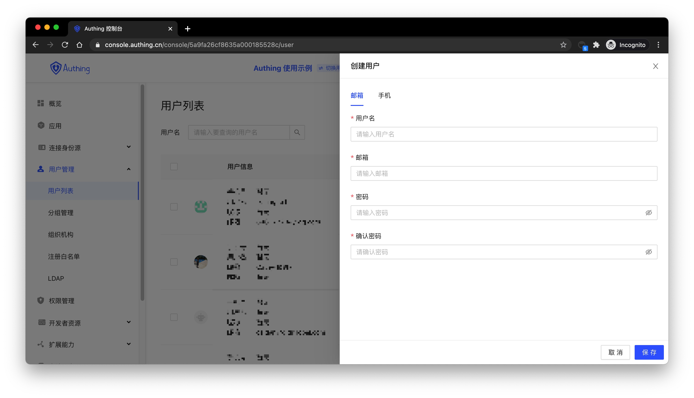

---
meta:
  - name: description
    content: Administrator create accounts
---

# Administrator Create Accounts

<LastUpdated/>

The similarities and differences between the account created by the administrator and the account registered by the user as follows:

- The account created by the administrator is not restricted by the "registration disabled" configuration.
- The account created by the administrator is not restricted by the "registration whitelist".
- Administrators do not need a verification code to create a phone account, but users need verify their phone number when registering an account by themselves.
- The `phoneVerified` field of the mobile phone number account created by the administrator is `false`, but the account registered by the user is `true`.
- Both the administrator's account creation and the user's self-registration cannot create duplicate mailboxes, phone numbers, and usernames.

Administrators can create users through the [console](#Create-accounts-using-the-console) or [SDK](#Create-accounts-using-the-SDK).

## Create accounts using the console

You can manually create an account in the **user management** -> **user list** of the console:

> You can create an account by email or phone number.

## Create accounts using the SDK

<StackSelector snippet="create-user" selectLabel="select your language" :order="['java', 'javascript', 'python', 'csharp']"/>
