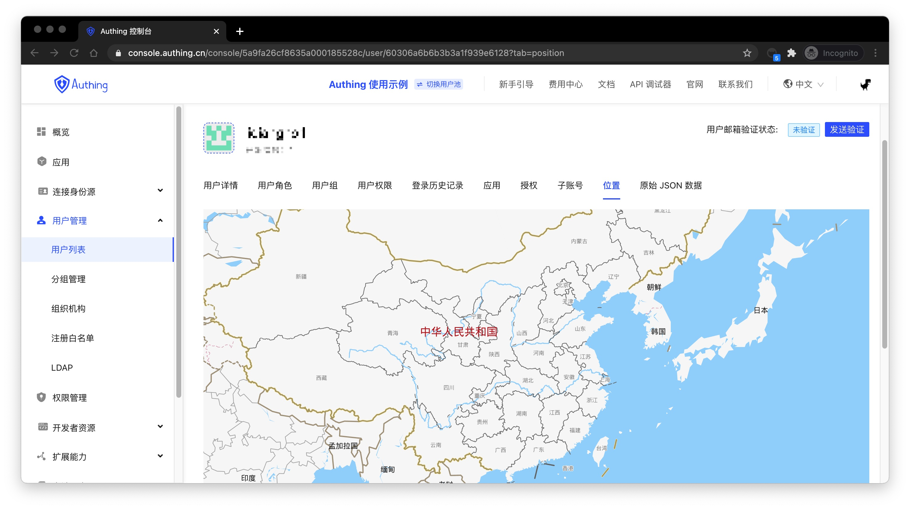

---
meta:
  - name: description
    content: Check the user's geographic location
---

# Check the user's geographic location

<LastUpdated/>

You can check the location of the user's last login on the **user details** page:

