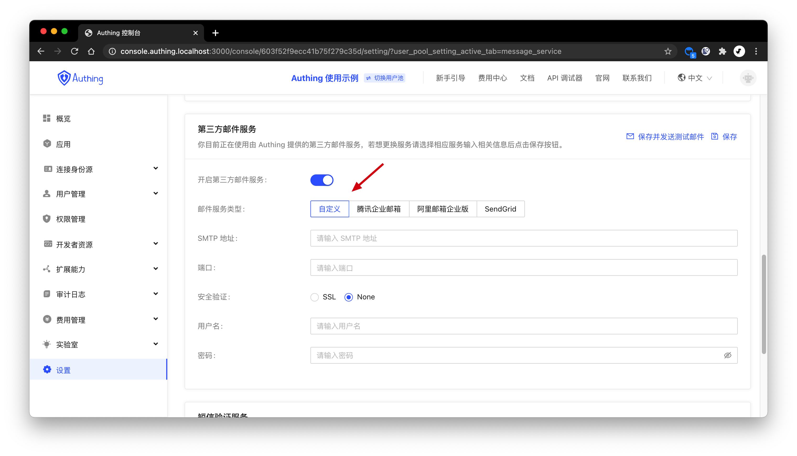

You can go to**configuration**-**message service**to configure[SMTP Service](https://en.wikipedia.org/wiki/Simple_Mail_Transfer_Protocol)：

You need to fill in following informaiton:

- SMTP address: SMTP server address;
- port: SMTP server port
- security protocol: if need to enable SSL；
- username: SMTP sender username
- password: SMTP sender password
