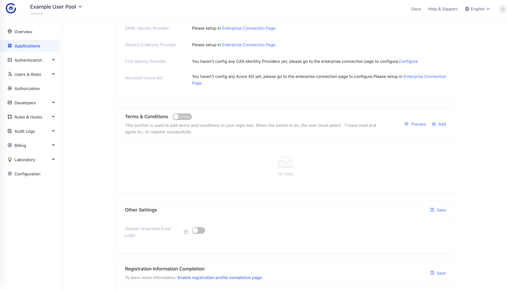
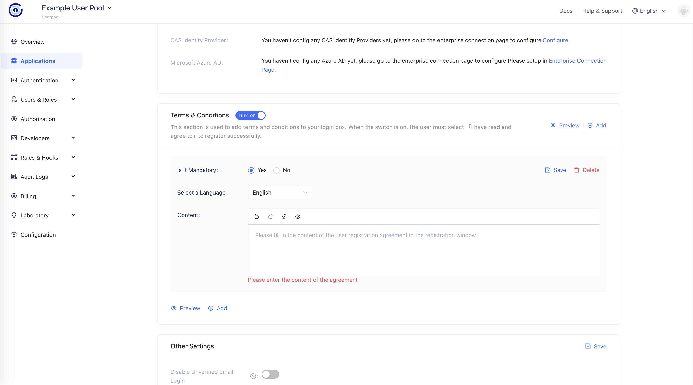
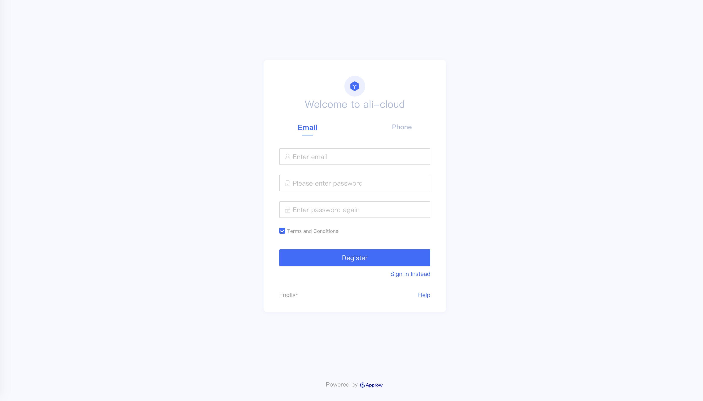

# Terms and Conditions

<LastUpdated/>

When user register, you have to ensure that they read and understand the Terms and Conditions. You can configure the Terms and Conditions in application detail under Register and Login tab.

## Customize Terms and Conditions

Enable Registration Terms. Then click add.
- Terms and Conditions Title are present in Login UI
- Terms and Conditions Type 
  - Link: Type in URL of your Terms and Conditions.
  - Text: Type in your Terms and Conditions in Text Editor.

After configuration, Login UI should looks like:

