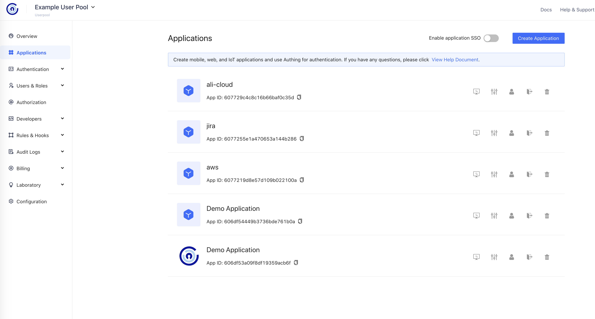
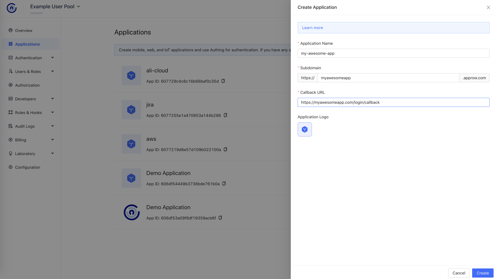
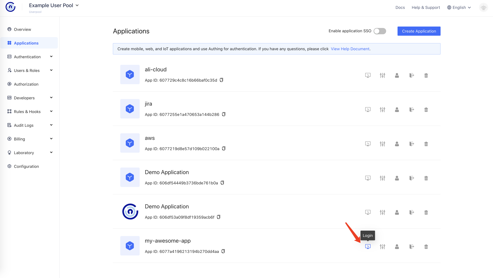
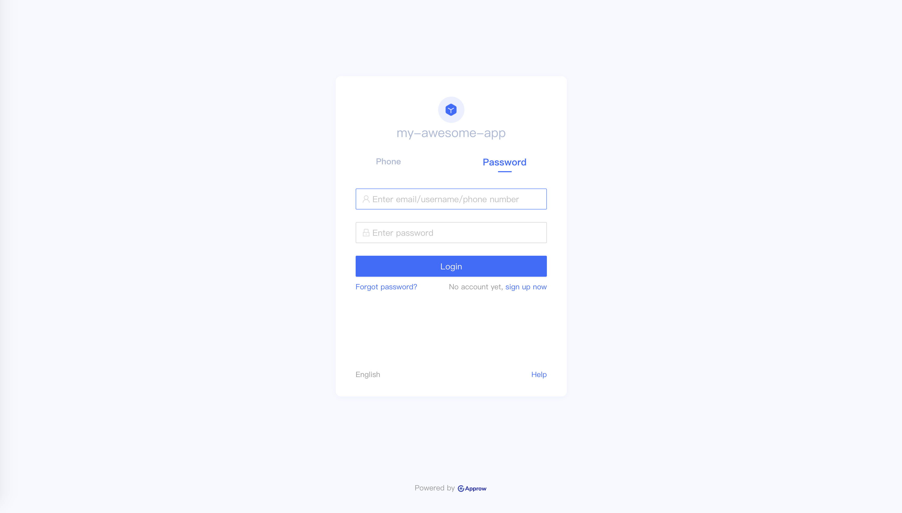

# Create Application

<LastUpdated/>

You can check all owning application under **Applications** tab in [console](https://console.approw.com):

Click **Create Application**, and provide below information:
- Application Name 
- Authentication domain: Use a second-level domain, must be valid domain format.  Eg:`my-awesome-app`
- Redirect URL: After successful login. Browser redirect user to this URL. You can exchange User information from this URL. Eg: `https://myawesomeapp.com/login/callback`

Click **Create**. 
Now you can click **Login** to access Login UI for this application

Now you can [Configuring Login Method](./config-login-methods.md).
