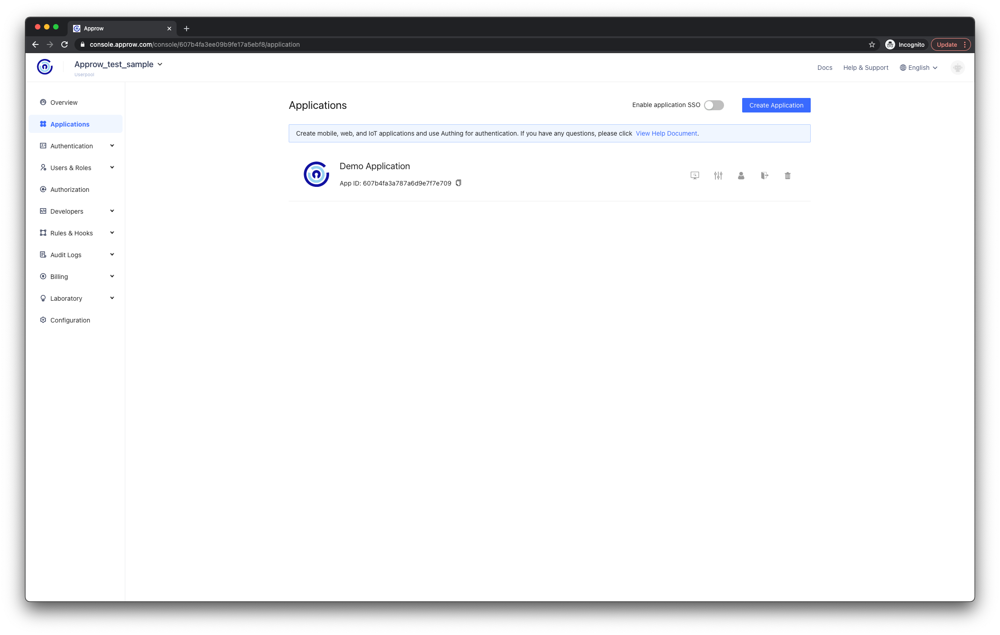
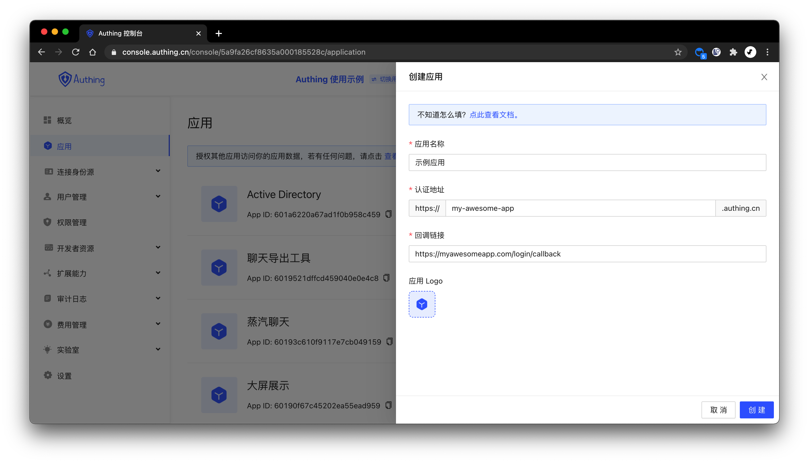
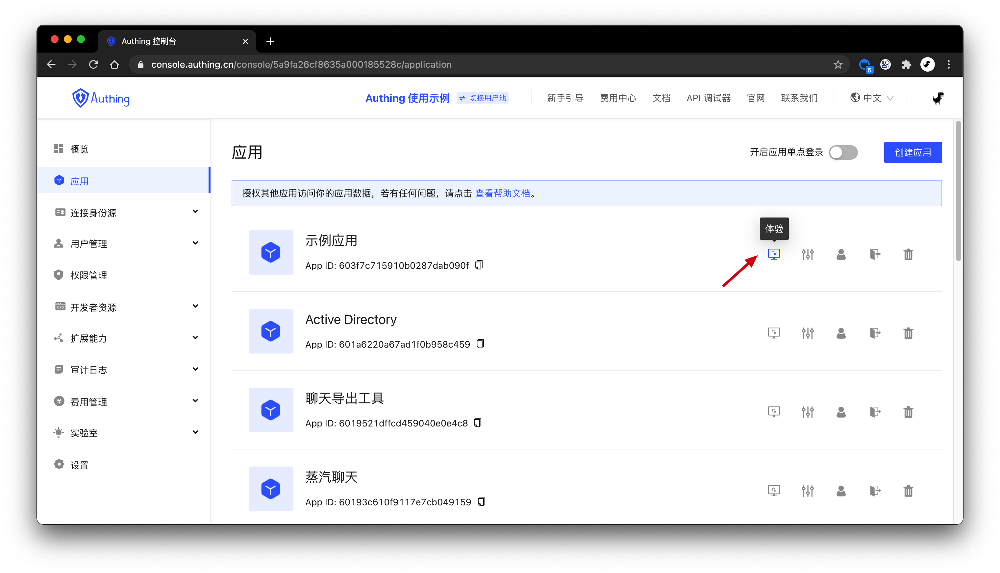
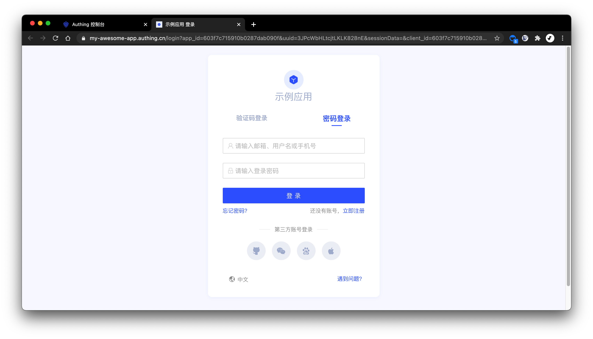

# 创建应用

<LastUpdated/>

你可以在[控制台](https://console.authing.cn)的**应用**页面查看自己的所有应用：

点击右上角的**创建应用**按钮，填入以下信息：

- 应用名称: 你的应用名称；
- 认证地址: 选择一个二级域名，必须为合法的域名格式，例如 `my-awesome-app`；
- 回调链接: 此链接需要填写你的业务回调地址，用户在此应用登录之后，浏览器将会跳转到这个地址，你可以在这里换取用户信息。示例：`https://myawesomeapp.com/login/callback`。

点击**创建**按钮。

创建好应用之后，你可以点击**体验**按钮访问该应用的在线登录表单：

接下来，你可以为此应用[配置登录注册方式](./config-login-methods.md)。
