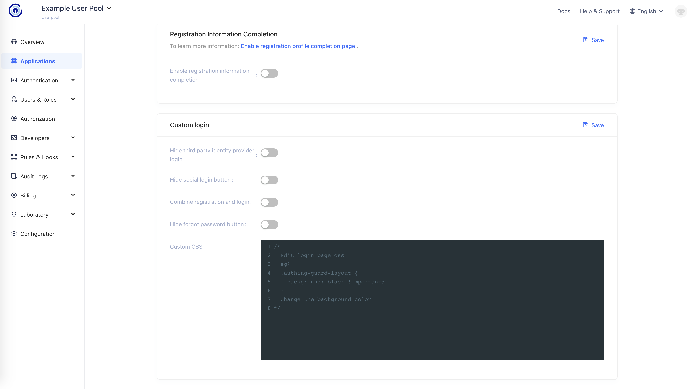
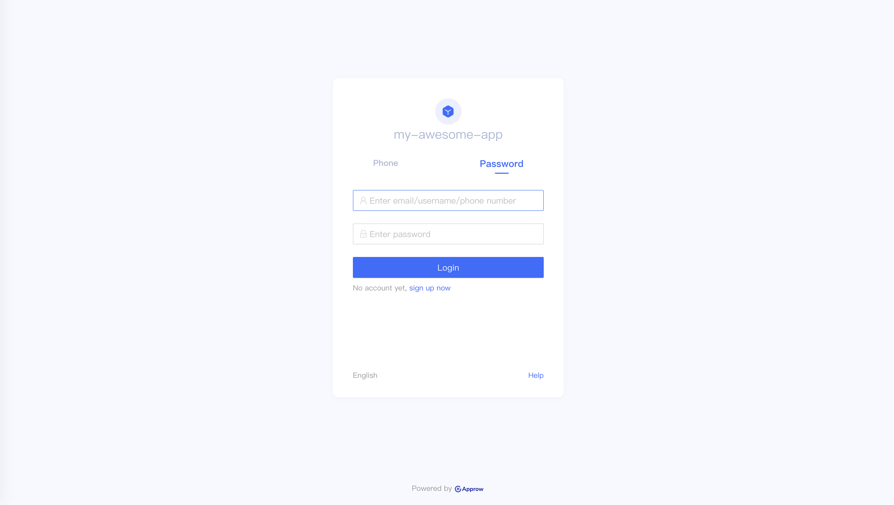
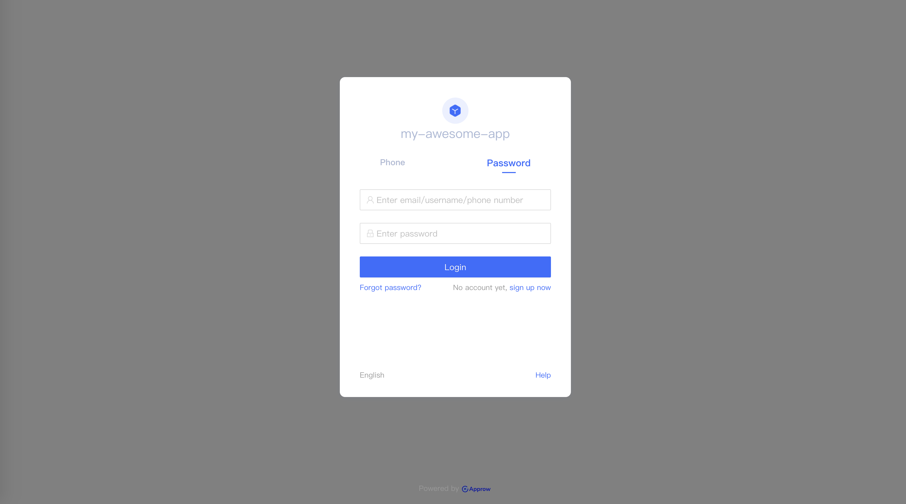
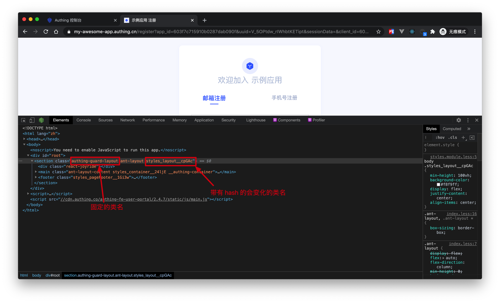

# Customize Login UI

<LastUpdated/>

{{$localeConfig.brandName}} provides several customization options. You will find it in **Applications** -> click your application -> **Register and Login**


## Configurable Item

### Hide Thrid party Identity Provider

Third party Identity Provider Login button will not show up in Login UI.

### Hide Social Registration/Login

Social Registration/Login button will not show up in Login UI.

### Combine Registration and Login

Once user enter username that does not exist in User Pool. Approw will create an account and login. User will receive account information from Approw.


### Hide Forgot Password 

Forgot Password button will not show up in Login UI

### Customize Login UI

{{$localeConfig.brandName}} allow developer to modify Login UI by changing CSS file. Eg: change background color.

```css
.approw-guard-layout {
  background: gray;
}
```



::: hint-warning
Note: You can check CSS class by Chrome Developer Tool. We have labeled out dom which can be customized. 
:::

<!---->
