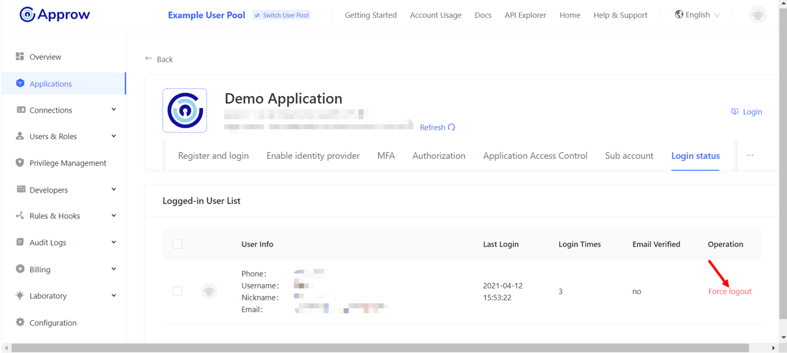

# Manage User Login Status

<LastUpdated/>

In the **Login status** tab of the **Application Details Page**, you can check all the users online for this application, as well as the last login time. Click **Force logout** can make the user log out of this application.

