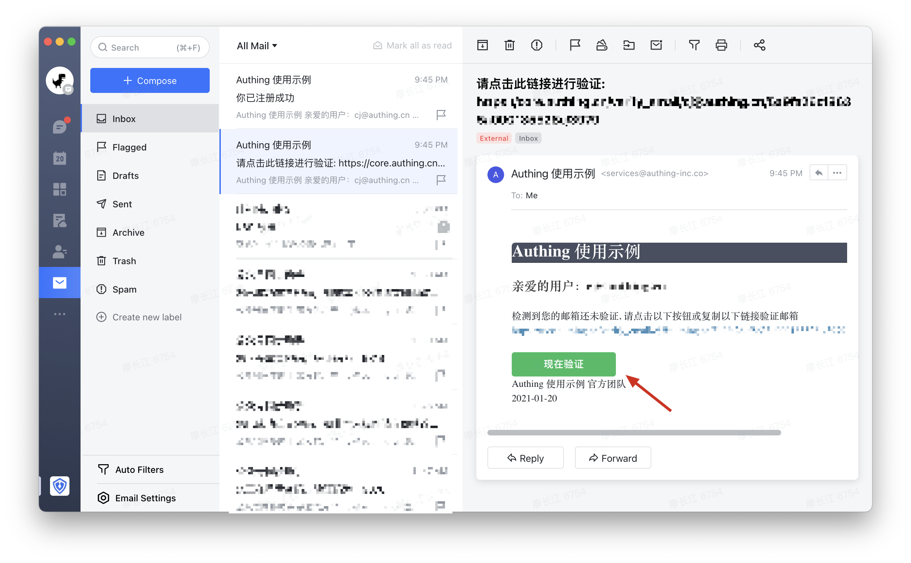

# Use Account & Password to Authenticate

<LastUpdated/>

In {{$localeConfig.brandName}}, account passwords are divided into the following three forms:

1. Email + password login
2. Username + password login
3. Phone number + password login

When providing users with account and password authentication methods, as an IT system administrator or developer, you also need to implement the following functions:

1. Password reset: the password can be retrieved by email verification code or SMS verification code;
2. Modify the password: You can reset the password with the existing password.

To use {{$localeConfig.brandName}} to achieve these functions, we provide three different integrate methods:

1. [Use {{$localeConfig.brandName}} hosted login page](#use-hosted-login-page) with no coding work needed. You can experience through {{$themeConfig.sampleAppDomain}}.
2. [Use embedded login component provided by {{$localeConfig.brandName}}](#use-embedded-login-component) This can be integrated within your Web or mobile project and you don't need to implement your own login form UI.
3. [Use API & SDK](#use-api-sdk), {{$localeConfig.brandName}} provides two different forms of API: RESTFul and GraphQL and more than ten other language SDKs. You can customize your UI and anthentication workflow based on that.

## Use hosted login page

### Registration

After the user has successfully registered, {{$localeConfig.brandName}} will send a welcome email to the user's mailbox:

> You can turn off the option of registering to send welcome email in the console settings > security information > user pool security configuration, and you can also modify the default welcome email template in the console settings > message service.

After the user has successfully registered, Approw will send a verification email to the user's mailbox:

The user can verify the mailbox by clicking the verify button.

### Login

By default, accounts with unverified mailboxes can log in. You can also modify this configuration in the application details:

After the user logs in successfully, it will call back to the callback link you configured. You can get user information here. For details, please see: Use {{$localeConfig.brandName}} hosted login page to authenticate.\

### Modify password

Users can modify password in the personal center.

## Use embedded login component

The embedded login component and the online hosting login page are basically the same in style and interaction. The difference is that the online hosting login page is fully managed and maintained by {{$localeConfig.brandName}}, which is completely independent of your application. The embedded login component can be integrated in your application.
For detailed usage, please see: [Use the embedded login component to authenticate](/guides/basics/authenticate-first-user/use-embeded-login-component/).

## Use API & SDK

### Register

<StackSelector snippet="register-by-email-password" selectLabel="choose language" :order="['java', 'javascript', 'python', 'csharp']"/>

### Login

<StackSelector snippet="login-by-email-password" selectLabel="choose language" :order="['java', 'javascript', 'python', 'csharp']"/>

### Reset password

<StackSelector snippet="reset-password" selectLabel="choose language" :order="['java', 'javascript', 'python', 'csharp']"/>

### Modify password

<StackSelector snippet="update-password" selectLabel="choose language" :order="['java', 'javascript', 'python', 'csharp']"/>
