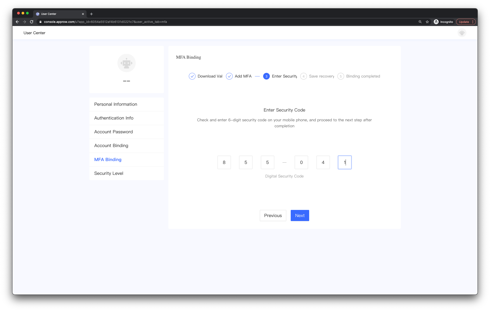
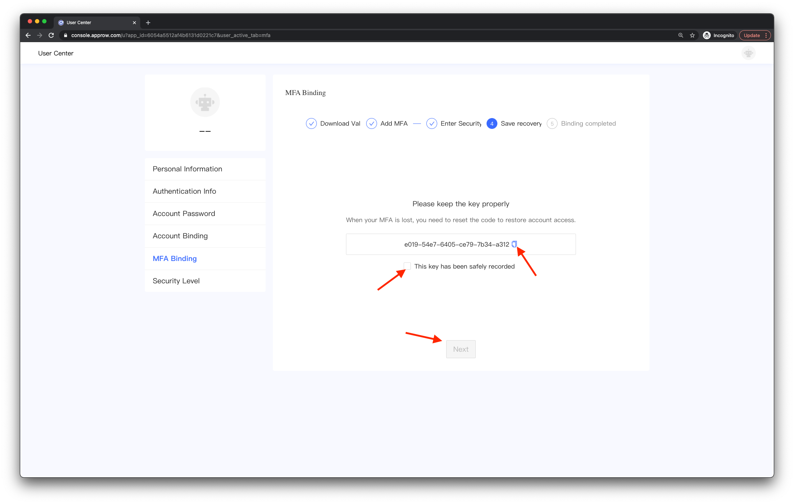
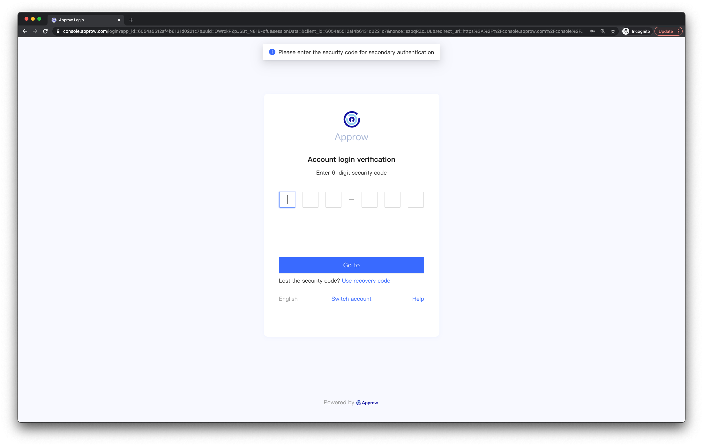
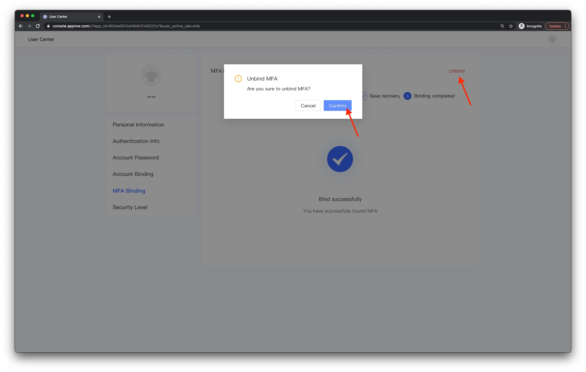

# 基于时间戳算法的一次性密码（TOTP）的 MFA

## 概述

多因素身份验证（MFA）是一种安全系统，是为了验证一项操作合法性而进行的二次身份验证。例如银行的 U 盾，异地登录要求手机短信验证。本文介绍的是一种随时间动态变化的 6 位数字口令（TOTP）多因素认证方式。

## 准备工作

1. <a :href="`${$themeConfig.consoleDomain}`">注册一个 {{$localeConfig.brandName}} 账号</a>
2. [完成用户池和应用的创建](/guides/basics/authenticate-first-user/use-hosted-login-page)

## 绑定 MFA

**1.访问 `https://<你的应用域名>.{{$themeConfig.officeSiteDomain}}` 进行登录。然后访问 `https://<你的应用域名>.{{$themeConfig.officeSiteDomain}}/u` 进入用户中心**

**2.点击左侧的 MFA 绑定，在手机打开 Google Authenticator / Microsoft Authenticator 扫码添加 MFA。本文使用 Microsoft Authenticator 添加 MFA**

::: img-description
如图所示，选择其他帐户
:::

**3.扫码后自动添加 MFA，可以在列表中查看刚刚添加的 MFA**

**4.在用户中心点击下一步，输入刚刚的添加的 MFA 上显示的动态口令，完成确认绑定，点击「下一步」**

::: img-description
在手机上查看 MFA 口令
:::

::: img-description
在绑定页面输入 MFA 口令
:::

**5.务必将这里展示的恢复代码安全保存，如果以后你丢失了 MFA，可以使用这个恢复代码来恢复账号访问。点击「下一步」。**

::: img-description
绑定成功
:::

## 使用 MFA 口令登录

**1.先从应用登出：`https://<你的应用域名>.{{$themeConfig.officeSiteDomain}}/oidc/session/end`，然后访问 `https://<你的应用域名>.{{$themeConfig.officeSiteDomain}}`，使用刚刚绑定过 MFA 的账号进行登录，会提示输入安全口令进行二次认证**

**2.输入正确的口令，完成二次认证，进行登录**

::: img-description
二次认证成功
:::

## 解绑 MFA

**1.点击「解除绑定」来解绑 MFA**

::: img-description
解绑成功
:::