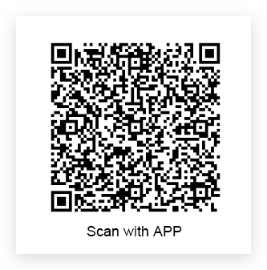
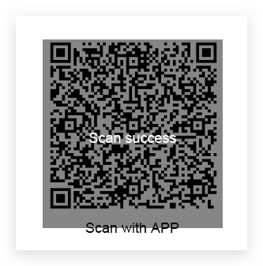

# Use The Self-built App to Implement QR Code Scanning Login

<LastUpdated/>

With the popularization of mobile Internet, mobile phones have become a necessity in people's lives, and it is becoming more and more common to use mobile phones to scan QR codes to complete authentication. More and more mobile applications integrate the function of scanning the QR code to log in to the PC-side website application, which is a convenient and safe experience for users. With the scanning and login capabilities provided by {{$localeConfig.brandName}}, this function can be implemented quickly and securely.

To implement the use of self-built mobile applications to scan QR codes to log in to website applications, it can be roughly divided into the following steps:

1, Generate a QR code on the Web and start polling the latest scanning status;
2, In the mobile APP, the user scans the code and agrees to authorize user information;
3, The web terminal receives the user information of the code scanning user, and the login is successful;

## Generate a QR code on the web and poll the scanning status

On the web side, we recommend using the [JavaScript SDK](/reference/sdk-for-node/authentication/QrCodeAuthenticationClient.md) provided by {{$localeConfig.brandName}}, which provides a one-click interface for generating a QR code, polling for the latest status, and obtaining user information for callbacks. Developers only need to specify the `onSuccess` callback function:

```js
import { AuthenticationClient } from "approw-js-sdk"
const authenticationClient = new AuthenticationClient({
   appId: "YOUR_APP_ID",
})

authenticationClient.qrcode.startScanning("qrcode", {
 onSuccess: (userInfo, ticket) => {
   console.log(userInfo, ticket)
 },
 onError: (message) => onFail && onFail(`${message}`),
});
```

After running, it will automatically generate a QR code for APP scanning login:



After the code is scanned successfully, {{$localeConfig.brandName}} will call back the `onSuccess` function passed in by the developer. The callback parameters include `userInfo` and `ticket`, and the `ticket` can be used to [get user information](./full-api-list.md#To-get-user-information-by-ticket).

If you want to customize the UI or want more customization capabilities, you can view the [complete API list](./full-api-list.md) or [use other SDK methods](/reference/sdk-for-node/authentication/QrCodeAuthenticationClient.md).

## Mobile APP scans QR code to authorize user information

The original information contained in the QR code generated on the web is a string of strings, which is converted to JSON as follows:

```json
{
    "scene": "APP_AUTH",
    "random": "5e05f0c57fde537d950f7da5",
    "userPoolId": "5e04ae0d5f3cee22fb37612b",
    "createdAt": "2019-12-27T11:53:41.260Z",
    "expireAt": "2019-12-27T11:55:41.260Z",
    "customData": { "hello": "world" }
}
```

The meanings of the fields are as follows:
- scene: scene value, APP_AUTH means APP QR code scan login.
- random: QR code ID, the mobile terminal will confirm the code scanning, agree to authorize, and cancel the authorization based on this ID (note that the "confirm code scanning" here means that the mobile terminal marks that the QR code has been scanned, but the user has not accept or cancel the operation. For the detailed status of the QR code, please see the complete interface list page)
- userPoolId: User pool ID.
- createdAt: the time when the QR code was created.
- expireAt: the expiration time of the QR code.
- customData: User-defined fields. To learn how to add custom data, please see the complete interface list page.

> For how to scan and parse the QR code in IOS, you can view [this article](https://github.com/darkjoin/Learning/wiki/use AVFoundation to get QR code).

To implement APP scanning and logging in to the Web, the APP user is required to be in the login state (it is of course possible), and the end user's token is required when calling the relevant interface. A total of three interfaces are required for the mobile terminal:
- Confirm code scanning
- Agree to authorize
- Cancel authorization

> To learn more about these three interfaces, please see the complete interface list page.

Let's take Objective-C as an example to implement consent to authorize login:

- The api address is: [http://core.approw.com/api/v2/qrcode/confirm](http://core.approw.com/api/v2/qrcode/confirm)
- Line 9 puts the user login credentials on the request header.

```objectivec
- (void) ConfirmAuthorization:(NSString *) random{
    NSURL * api =[NSURL URLWithString:@"http://core.approw.com/api/v2/qrcode/confirm"];
    NSDictionary *bodyDict = @{
        @"random": random,
    };
    NSData *body = [NSJSONSerialization dataWithJSONObject:bodyDict options:kNilOptions error:nil];
    NSMutableURLRequest *request = [[NSMutableURLRequest alloc] initWithURL:api];
    request.HTTPMethod = @"POST";
    [request setValue:self.USER_TOKEN forHTTPHeaderField:@"Authorization"];
    [request setValue:@"application/json" forHTTPHeaderField:@"Content-Type"];
    [request setValue:@"application/json" forHTTPHeaderField:@"Accept"];
    [request setHTTPBody:body];

    NSURLSessionConfiguration *config = [NSURLSessionConfiguration defaultSessionConfiguration];
    NSURLSession *session = [NSURLSession sessionWithConfiguration:config];
    NSURLSessionDataTask *dataTask = [session dataTaskWithRequest:request completionHandler:^(NSData *data, NSURLResponse *response, NSError *error) {
        NSHTTPURLResponse *httpResponse = (NSHTTPURLResponse *)response;
        if(httpResponse.statusCode == 200)
        {
            NSError *parseError = nil;
            NSDictionary *responseDictionary = [NSJSONSerialization JSONObjectWithData:data options:0 error:&parseError];
            NSLog(@"The response is - %@",responseDictionary);
            NSInteger code = [[responseDictionary objectForKey:@"code"] integerValue];
            if(code == 200)
            {
                NSLog(@"SUCCESS");
            }
            else
            {
                NSLog(@"FAILURE");
            }
        }
        else
        {
            NSLog(@"Network Error");
        }
    }];

    [dataTask resume];
}
```

After the mobile terminal confirms the authorization, you will see the relevant prompt on the web.




At this time, the entire login process is complete, and developers can use the ticket to get user information.

```javascript
const authenticationClient = new AuthenticationClient({
   appId: "YOUR_APP_ID",
})
const user = await authenticationClient.qrcode.exchangeUserInfo('TICKET')
```

## Then

After obtaining the user information, you can get the user's identity credential (the token field of the user information). You can carry this token in the subsequent request sent by the client to the back-end server. Take axios as an example:

```js
const axios = require("axios");
axios
  .get({
    url: "https://yourdomain.com/api/v1/your/resources",
    headers: {
      Authorization: "Bearer YOUR_JWT_TOKN",
    },
  })
  .then((res) => {
    // custom codes
  });
```
The validity of this `token` needs to be verified in the back-end interface to verify the user's identity. For details of the verification method, please refer to [verifying user identity credentials (token)](/guides/faqs/how-to-validate-user-token.html). After identifying the user, you may also need to [perform permission management on the user](/guides/access-control/) to determine whether the user has operating permissions for this API.
