---
meta:
  - name: description
    content: 控制台概览
---

# 控制台概览

<LastUpdated/>

控制台是你管理和配置所有 Authing 资源的地方，这篇文章会帮助你学会使用 Authing 控制台提升生产力！

在 [Authing 控制台](https://console.authing.cn/console/userpool)中你可以对 Authing 的资源、用户等信息进行配置和修改。

::: img-description
控制台概览
:::

以下会**从上往下**介绍控制台每个模块：

<table>
  <thead>
    <tr>
      <th style="text-align:left">模块名</th>
      <th style="text-align:left">我能在这里做什么？</th>
    </tr>
  </thead>
  <tbody>
   <tr>
      <td style="text-align:left"><b>概览</b></td>
      <td style="text-align:left">
        
应用入口：

        <ol>
          <li>登录框；</li>
          <li>添加登录方式；</li>
          <li>集成应用；</li>
        </ol>
        
查看用户的登录状况，比如：

        <ol>
          <li>总用户数；</li>
          <li>今日增加的用户数量；</li>
          <li>七天内注册和登录的用户数量等；</li>
        </ol>
        
还可以热点图的形式查看近一年的用户活动情况。

      </td>
    </tr>
        <tr>
      <td style="text-align:left"><b>应用</b></td>
      <td style="text-align:left">
        
在此可以创建和管理应用，比如：

        <ol>
          <li>为应用集成 OIDC 协议</li>
          <li>为应用集成 OAuth 2.0 协议</li>
          <li>为应用集成 SAML 协议</li>
          <li>修改默认页面显示配置、添加自定义 CSS</li>
          <li>配置多因素认证。</li>
        </ol>
      </td>
    </tr>
    <tr>
      <td style="text-align:left"><b>连接身份源</b></td>
      <td style="text-align:left">
        
在这里可以连接第三方的身份源，比如：

        <ol>
          <li>配置社会化登录</li>
          <li>连接企业身份源（OIDC、SAML、办公应用如钉钉企业微信）</li>
        </ol>
      </td>
    </tr>
    <tr>
      <td style="text-align:left"><b>用户管理</b></td>
      <td style="text-align:left">
        
在这里可以管理系统中的所有用户，比如：

        <ol>
          <li>查看/修改用户的基础资料；</li>
          <li>查看登录历史、登录地点和原始 JSON 数据；</li>
          <li>设置用户组和用户角色；</li>
          <li>创建组织机构。 </li>          
        </ol>
      </td>
    </tr>
    <tr>
      <td style="text-align:left"><b>权限管理</b></td>
      <td style="text-align:left">
        
在这里可以围绕资源、基于 PBAC（策略模型）进行精细化的权限管理，比如：

        <ol>
          <li>查看和添加资源</li>     
          <li>查看和添加策略</li>     
          <li>为用户、角色、分组、组织机构授权策略</li>     
        </ol>
      </td>
    </tr>
    <tr>
      <td style="text-align:left"><b>开发者资源</b></td>
      <td style="text-align:left">
        
查到开发所需要的 API、SDK等

        <ol>
          <li>API；</li>
          <li>快速集成；</li>
          <li>Web UI;</li>
          <li>SDK;</li>
        </ol>
      </td>
    </tr>
    <tr>
      <td style="text-align:left"><b>扩展能力</b>
      </td>
      <td style="text-align:left">
      
Pipeline、Webhook、自定义密码函数提升认证过程的灵活性和可扩展性

      <ol>
        <li>Pipeline;</li>
        <li>Webhook;</li>
        <li>自定义密码函数。</li>
      </ol>
      </td>
    </tr>
    <tr>
      <td style="text-align:left"><b>审计日志</b>
      </td>
      <td style="text-align:left">
      
在此可以查看用户操作日志和管理员日志。

      </td>
    </tr>
     <tr>
      <td style="text-align:left"><b>费用管理</b>
      </td>
      <td style="text-align:left">
      
在此可以服务升级以及查看订单详情。

      </td>
    </tr>
    <tr>
      <td style="text-align:left"><b>实验室</b>
      </td>
      <td style="text-align:left">
      
在此可以配置应用面板和创建相关同步任务。

      </td>
    </tr>
    <tr>
      <td style="text-align:left"><b>设置</b>
      </td>
      <td style="text-align:left">
      
编辑或删除用户池，修改消息服务的配置

      <ol>
        <li>用户池信息;</li>
        <li>安全信息;</li>
        <li>消息服务;</li>
        <li>扩展字段;</li>
        <li>协作管理员;</li>
      </ol>
      </td>
    </tr>
  </tbody>
</table>

## 应用

### 应用列表

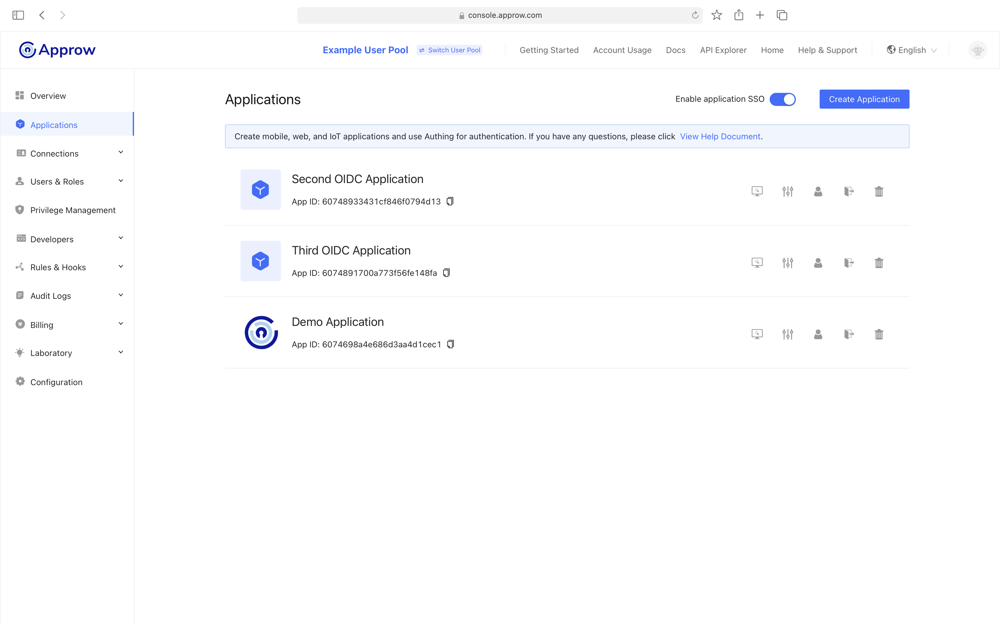
::: img-description
应用列表
:::

### 应用详情

在此可以配置 OIDC 协议、配置 OAuth2.0 协议、配置 SAML 协议，修改应用显示配置等：

::: img-description
应用详情
:::

### 连接社会化登录

::: page-ref /guides/connections/social.md
:::

## 连接身份源

Authing 可以连接社会化登录、企业身份源、自定义数据库。

### 社会化登录

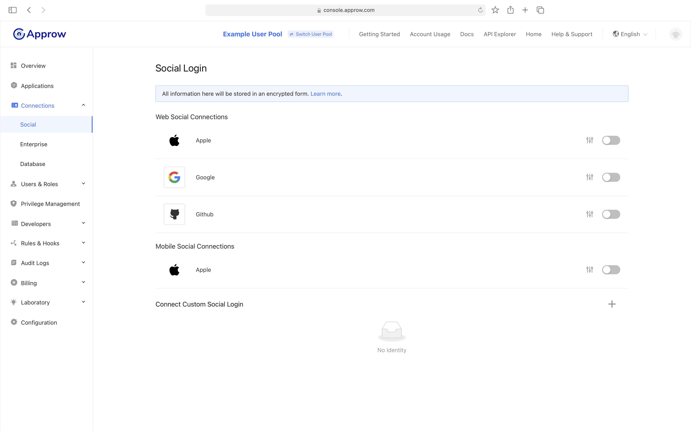
::: img-description
社会化登录
:::

### 企业身份源

::: img-description
企业身份源
:::

### 自定义数据库

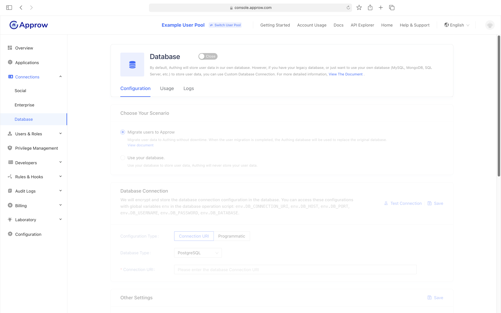
::: img-description
自定义数据库
:::

## 用户管理

### 用户列表

::: img-description
用户列表
:::

### 用户详情

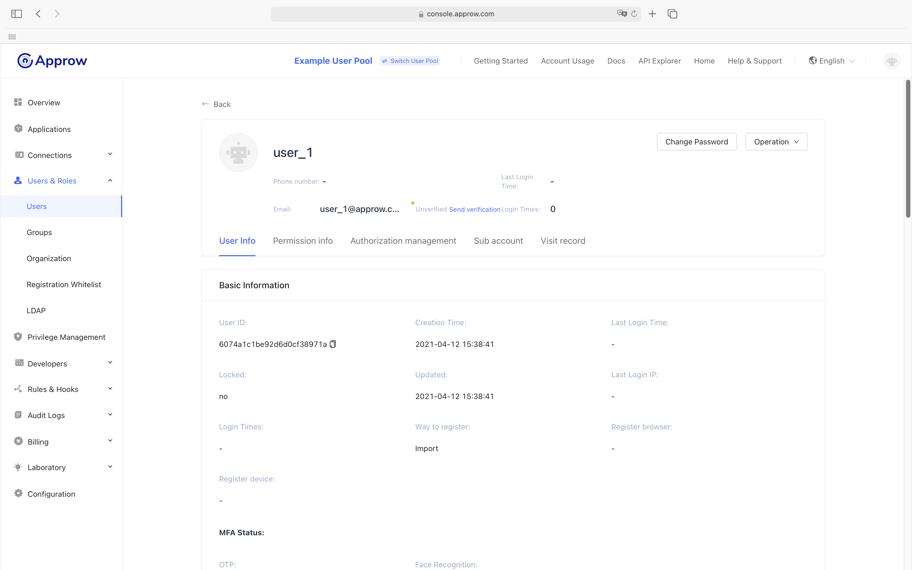
::: img-description
用户详情
:::

## 分组管理

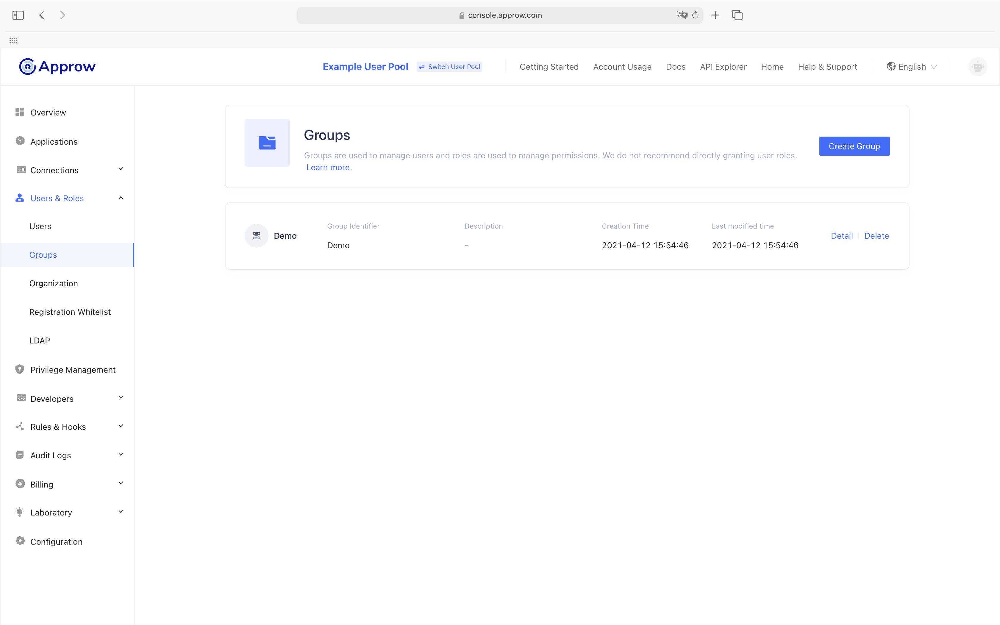

::: img-description
分组管理
:::

### 组织机构

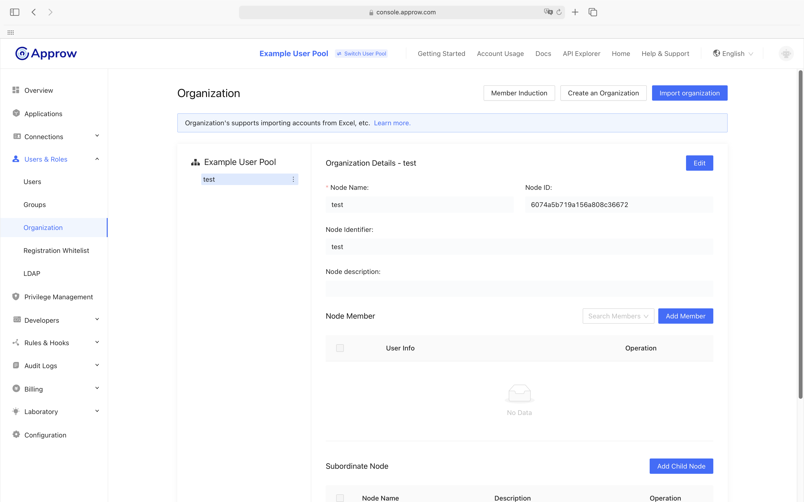

::: img-description
组织机构
:::

### 注册白名单

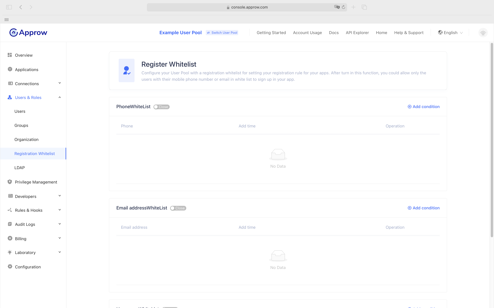

::: img-description
注册白名单
:::

### LDAP

::: img-description
LDAP
:::

## 权限管理

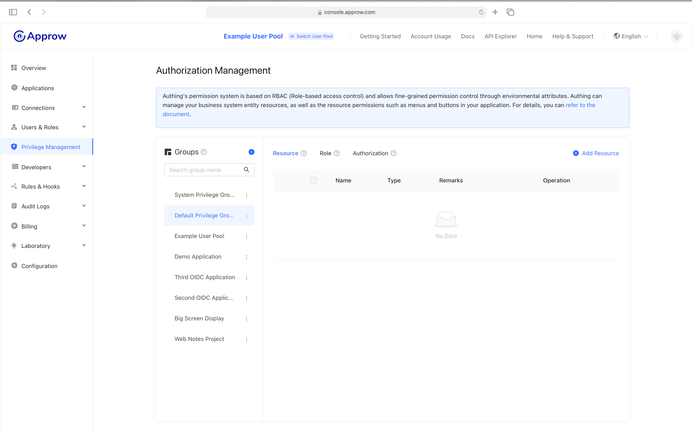
::: img-description
权限管理
:::

## 开发者资源

开发者资源你可在开发者资源页中查到开发所需要的 API、SDK 等必备信息

::: img-description
SDK
:::

## 扩展能力

Authing 的 Pipeline、 Webhook、自定义密码函数极大地提升了认证过程中的灵活性，赋能用户自动化处理复杂场景。

### Pipeline

::: img-description
Pipeline
:::

### Webhook

::: img-description
Webhook
:::

### 自定义密码强度和加密函数

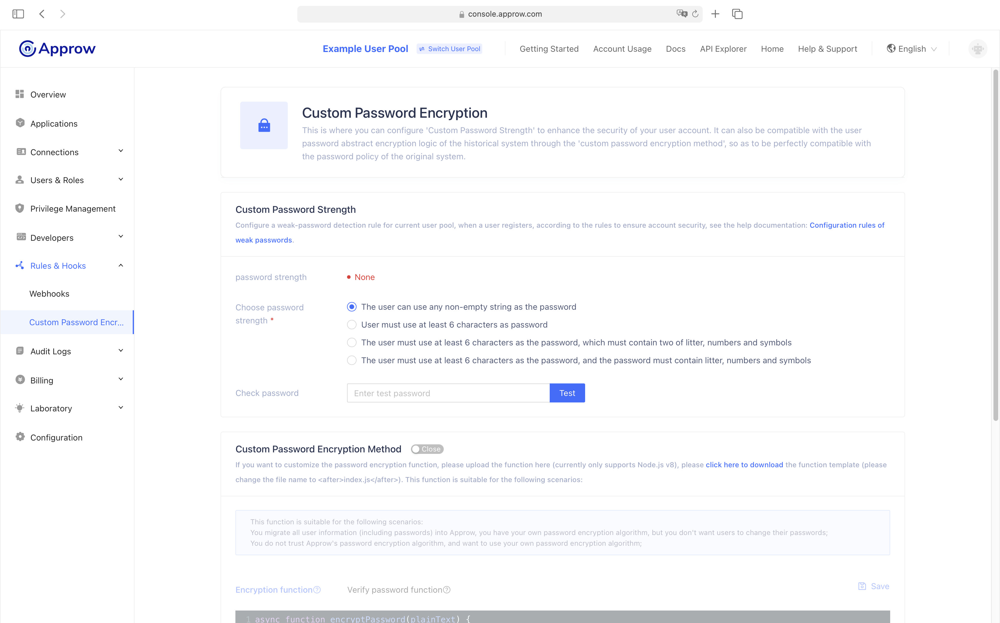

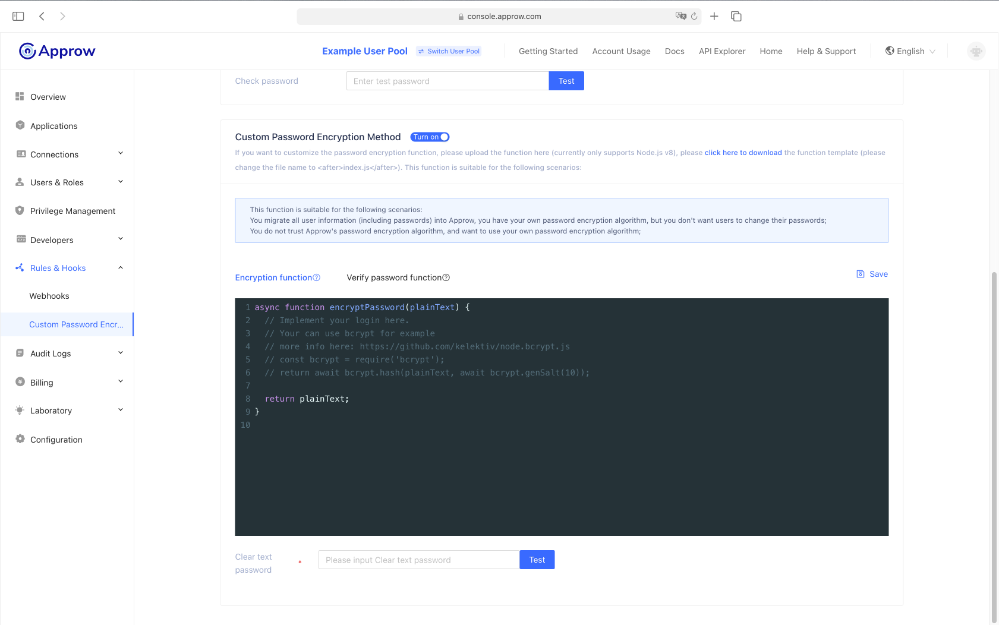

## 审计日志

你可以查看最近的用户行为日志和管理员操作日志。

### 用户行为日志

::: img-description
用户行为日志
:::

### 管理员操作日志

::: img-description
管理员操作日志
:::

## 费用管理

### 服务信息

::: img-description
服务信息
:::

### 订单信息

::: img-description
订单信息
:::

## 实验室

### 应用面板

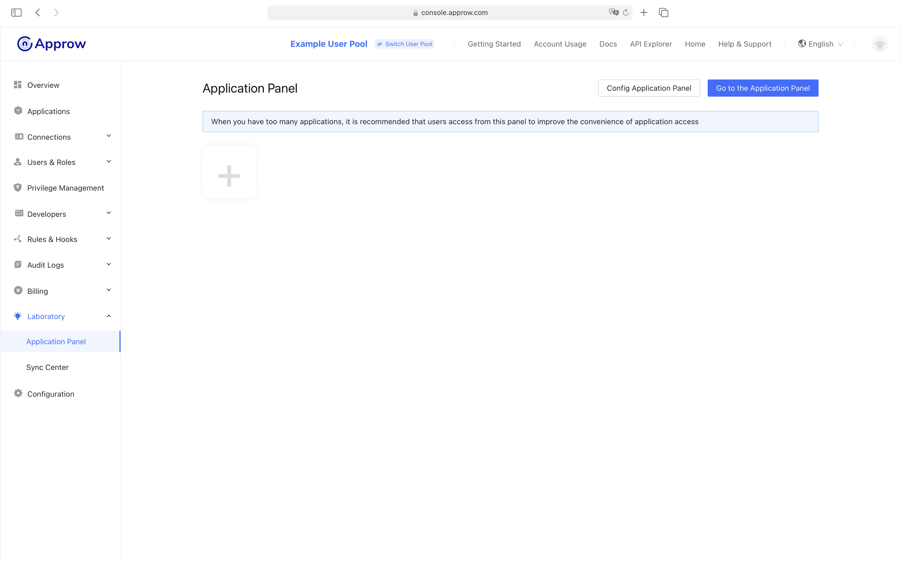
::: img-description
应用面板
:::

### 同步中心

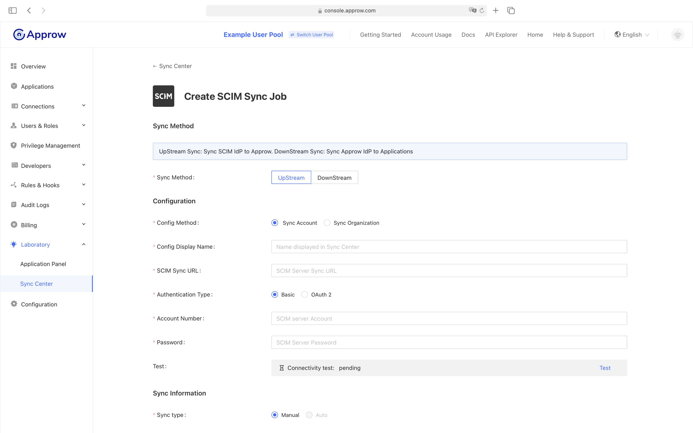
::: img-description
同步中心
:::

## 设置

### 基本设置

::: img-description
基本设置
:::

### 安全信息

1. 安全域
2. JWT 到期时间
3. 是否禁止注册
4. 是否开启频繁注册限制
5. 是否开启频繁登录失败限制
6. 是否开启邮箱验证

安全域（Allowed Origins） 是允许从 JavaScript 向 Authing API 发出请求的 URL（通常与 CORS 一起使用）。 默认情况下，系统会允许你使用所有网址（\*）。 如果需要，此字段允许你输入其他来源。 你可以通过逐行分隔多个有效 URL，并在子域级别使用通配符（例如：[https://\*.sample.com）。](https://*.sample.com）。) 验证这些 URL 时不考虑查询字符串和哈希信息，如果带上了查询字符串和哈希信息系统会自动忽略整个域名。

::: img-description
配置安全域
:::

### 消息服务

#### 使用邮件模版

在邮件模版中可以配置四种类型的邮件模版，分别是：

1. **欢迎邮件** ：若用户使用邮箱注册会发送此邮件；
2. **验证邮件** ：若用户使用邮箱注册会发送一封验证邮件给用户用来验证邮箱，用户点击邮箱中的链接即可完成验证；
3. **修改密码** ：每当用户要求更改密码时，都会发送此电子邮件，邮件中附带一个验证码，用户需要填写此验证码完成密码修改；
4. **重置密码** ：当用户忘记密码时系统将发送此重置密码的邮件，邮件中附带一个验证码，用户提交验证码和新密码后将可以重置密码。

::: img-description
邮件模版
:::

#### 使用第三方邮件服务

我们自带的邮件发送服务器使用阿里云企业邮箱，若你想自定义邮件服务器可在此页面中设置（目前支持阿里企业邮箱和腾讯企业邮箱）。

::: img-description
第三方邮件服务
:::

更多用法请参考：

::: page-ref /guides/userpool-config/email/
:::

#### 查看短信登录模版

短信验证让用户能够使用以短信形式发送到其手机上的一次性密码登录，目前不支持短信模版修改。

::: img-description
短信验证
:::
