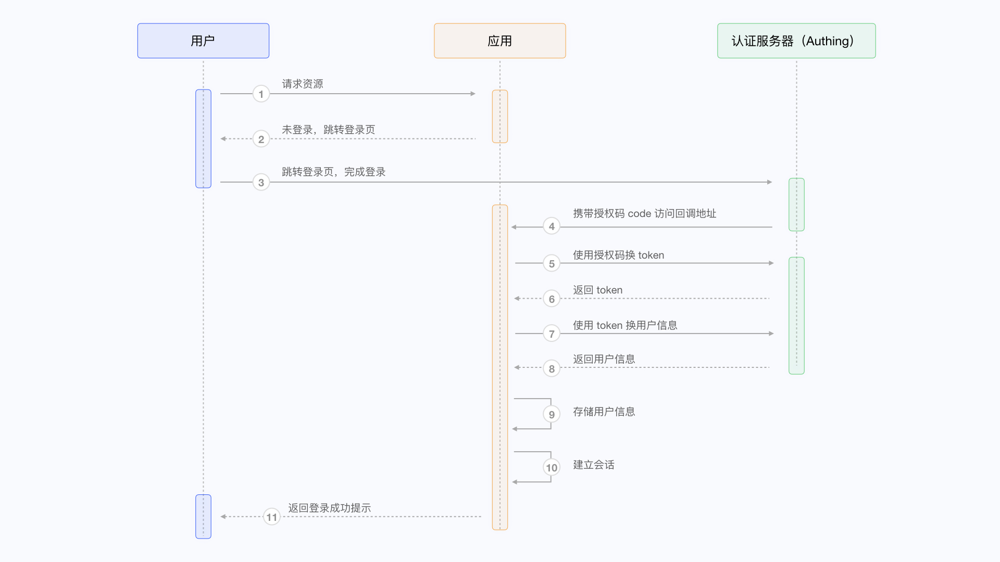
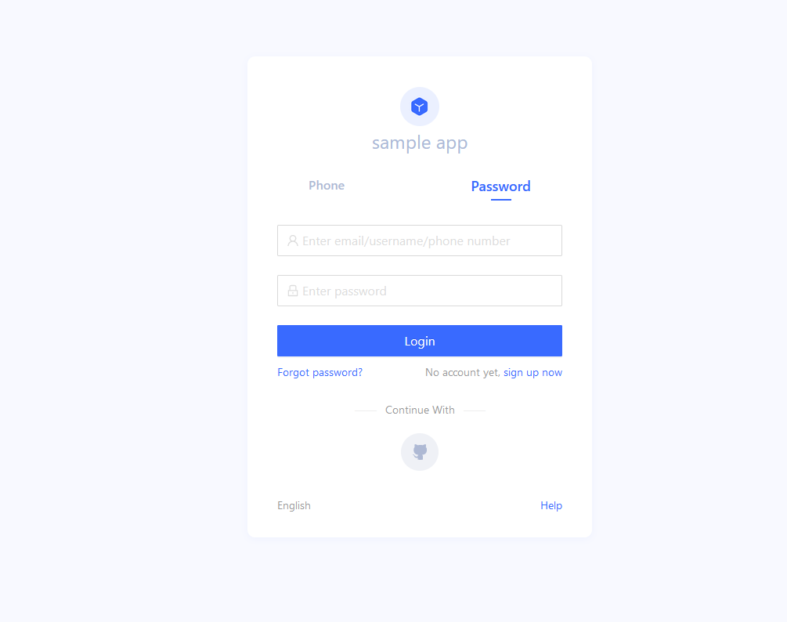
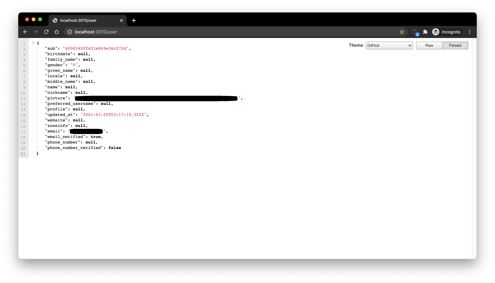
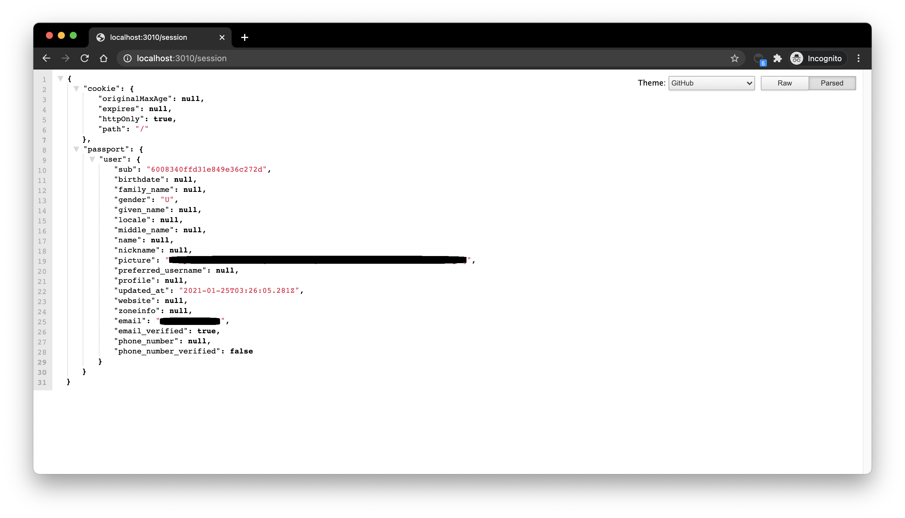

# 在传统 Web App 中集成 {{$localeConfig.brandName}}

<LastUpdated/>

本文以 Node.js Web 框架 [Express](https://expressjs.com/) 为例，介绍如何在传统的 Web 项目（如 Express MVC 、Django、PHP Laravel 等）中快速接入 {{$localeConfig.brandName}}，实现登录、退出、获取用户信息等功能。

这里一共牵涉到三方：终端用户、应用服务器、 {{$localeConfig.brandName}} 服务器，完整流程如下：

1. 用户请求应用服务，发现用户未登录，跳转到 {{$localeConfig.brandName}} 托管的登录页；
2. 用户在此登录页完成登录之后，浏览器会在请求参数中携带授权码 (Authorization Code) 等数据跳转到应用服务器预先配置好的回调链接；
3. 应用服务器使用授权码 (Authorization Code) 向 {{$localeConfig.brandName}} 服务器请求换取用户信息；
4. 应用服务器获取到用户信息之后，建立与终端用户的会话；
5. 终端用户得到登录成功提示，认证流程完成。

流程图如下所示：



## 在 {{$localeConfig.brandName}} 中进行配置

在开始前，你需要在 {{$localeConfig.brandName}} 中创建一个应用。你可以前往 {{$localeConfig.brandName}} 控制台的应用列表页面创建应用。

### 配置回调链接

当用户在 {{$localeConfig.brandName}} 登录成功之后，浏览器会跳转到你配置的回调链接（Callback URL）。此回调链接应该是你应用中的一个路由，你需要在此路由中完成换取用户信息等操作。你必须配置此回调链接，否则用户将无法登录，而会显示 `invalid_redirect_uri` 错误提示。

此示例代码的回调链接为 `http://localhost:3000/auth/callback`，将其复制到登录回调 URL 配置项中，然后点击保存。


### 配置退出回调链接

用户在 {{$localeConfig.brandName}} 托管登录页退出登录之后，你需要配置退出登录之后的回调地址（Logout URLs）。你必须配置此回调链接，否则用户将无法退出，而会显示 `misconfiguration` 错误提示。
此示例代码的回调链接为 `http://localhost:3000`，将其复制到退出回调 URL 配置项中，然后点击保存。

### 获取应用 ID 和密钥

最后，你需要复制并保存好以下内容：

- clientId: 应用 ID。
- clientSecet: 应用的密钥。
- Issuer URL: https://sample-app.authing.cn/oidc

## 集成 {{$localeConfig.brandName}} 到你的系统

### 安装依赖

你需要安装支持标准 OIDC 协议的 [openid-client](http://github.com/panva/node-openid-client) 和 [passportjs](http://www.passportjs.org/) ，Java 开发者可以使用 Spring 框架的 [spring-security](https://spring.io/projects/spring-security)，[详细接入流程请见文档](/frameworks/spring-security/)。

```bash
yarn add express express-session passport openid-client
```

### 初始化

在项目的最开始我们需要初始化 `openid-client` 的 `Issuer`，初始化参数如下：

- client_id: OIDC Client ID，在 {{$localeConfig.brandName}} 中即你的[应用 ID](/guides/faqs/get-app-id-and-secret.md)；
- client_secret: OIDC Client Secret，在 {{$localeConfig.brandName}} 中即你[应用的密钥](/guides/faqs/get-app-id-and-secret.md)；
- issuer: OIDC Issuer，你可以在应用的端点信息中获取。


这里出于演示考虑，`passport.serializeUser` 中直接传 `user` 给回调函数 `done`，这会将用户信息存储在 `req.session.passport.user` 中，正式生产环境下不建议这么做，因为如果用户信息被修改而 `session` 没有更新，会造成数据不一致。`passport.deserializeUser` 传给回调函数 `done` 的第二个参数将会挂载到 `req.user` 上。如果你对 [psssport.js](http://www.passportjs.org) 还不够了解，建议先阅读 [psssport.js 官方文档](http://www.passportjs.org/docs/)。

```javascript
passport.serializeUser(function(user, done) {
  console.log("serializeUser", user);
  done(null, user.sub);
});
passport.deserializeUser(function(userId, done) {
  console.log("deserializeUser", userId);
  done(null, userId);
});
```

详细示例代码如下：

```javascript
const express = require("express");
const session = require("express-session");
const passport = require("passport");
const { Strategy, Issuer } = require("openid-client");

const OIDC_CLIENT_ID = "YOUR_APPLICATION_ID";
const OIDC_CLIENT_SECRET = "YOUR_APPLICATION_SECRET";
const OIDC_ISSUER = "YOUR_OIDC_ISSUER";
const REDIRECT_URI = "http://localhost:3000/auth/callback";

(async () => {
  const issuer = await Issuer.discover(OIDC_ISSUER);
  const client = new issuer.Client({
    client_id: OIDC_CLIENT_ID,
    client_secret: OIDC_CLIENT_SECRET,
    id_token_signed_response_alg: "HS256",
    token_endpoint_auth_method: "client_secret_post",
  });

  passport.use(
    "oidc",
    new Strategy(
      {
        client,
        params: {
          redirect_uri: REDIRECT_URI,
          scope: "openid profile email phone",
          grant_type: "authorization_code",
          response_type: "code",
        },
      },
      (tokenset, userinfo, done) => {
        return done(null, userinfo);
      }
    )
  );

  passport.serializeUser(function(user, done) {
    done(null, user);
  });
  passport.deserializeUser(function(user, done) {
    done(null, user);
  });

  const app = express();
  app.use(
    session({
      secret: "secret",
      resave: true,
      saveUninitialized: true,
    })
  );
  app.use(passport.initialize());
  app.use(passport.session());
  app.listen(3010, () =>
    console.log(`Example app listening at http://localhost:3010 🚀`)
  );
})();
```

### 完成登录逻辑

首先我们初始化一个登录路由：

```javascript
app.get("/login", passport.authenticate("oidc"));
app.get(
  "/auth/callback",
  passport.authenticate("oidc", {
    successRedirect: "/user",
    failureRedirect: "/403",
  })
);
```

访问 `/login` 的时候调用 `passport.authenticate`，系统会跳转到 {{$localeConfig.brandName}} OIDC Provider 的线上登录地址：



使用其中任意一种登录方式登录之后，浏览器会跳转到 `http://localhost:3000/auth/callback`（这是我们第一步中在应用详情中配置的回调链接），在这里会向 {{$localeConfig.brandName}} 服务器获取用户信息，获取用户信息成功之后再跳转到 `/user` 路由。

### 完成展示用户信息逻辑

接下来我们来实现 `/user` 路由的逻辑，前面介绍到用户登录成功之后用户信息会被挂载到 `req.user` 上，所以这里我们添加以下简单的逻辑：

```javascript
app.get("/user", (req, res) => {
  res.send(req.user);
});
app.get("/session", (req, res) => {
  res.send(req.session);
});
```

访问 `/user` 可以看到当前登录用户的用户信息：



访问 `/session` 可以看到当前登录用户的 `session`：



### 完成退出登录逻辑

最后我们实现退出登录逻辑：

1. 首先通过 `req.session.destroy()` 清除当前应用的 `session`；
2. 跳转到 OIDC 应用的退出登录链接。

```javascript
const OIDC_LOGOUT_URL = "{{YOUR_APP_DOMAIN}}/login/profile/logout";
const LOGOUT_REDIRECT_URL = "http://localhost:3000";
app.get("/logout", (req, res) => {
  req.session.destroy();
  const logoutUrl = `${OIDC_LOGOUT_URL}?app_id=${OIDC_CLIENT_ID}&redirect_uri=${LOGOUT_REDIRECT_URL}`;
  res.redirect(logoutUrl);
});
```
