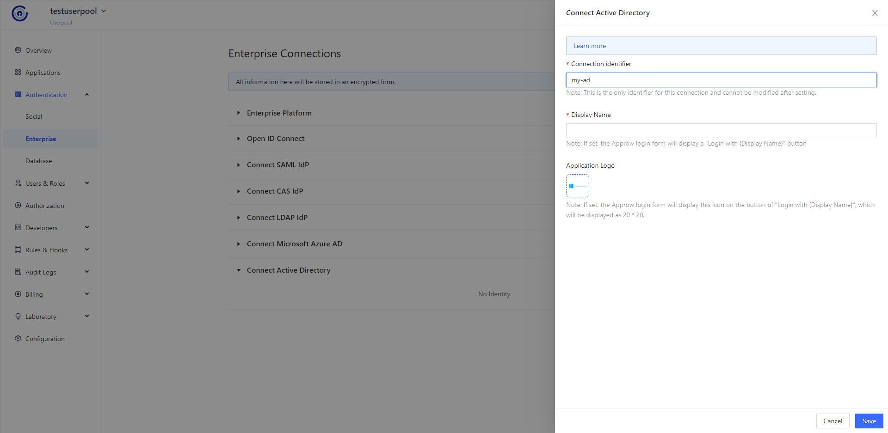
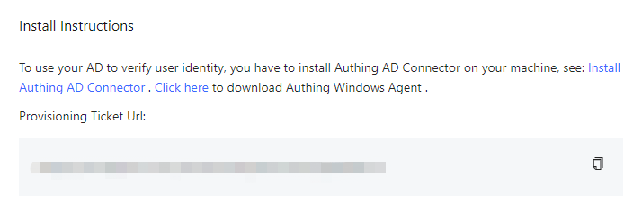
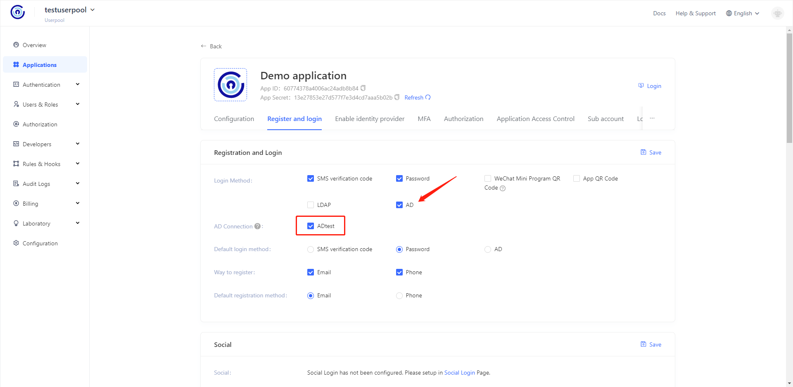
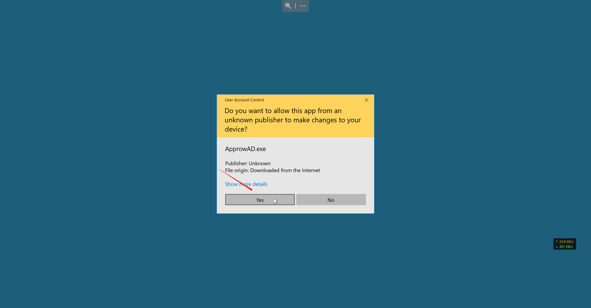
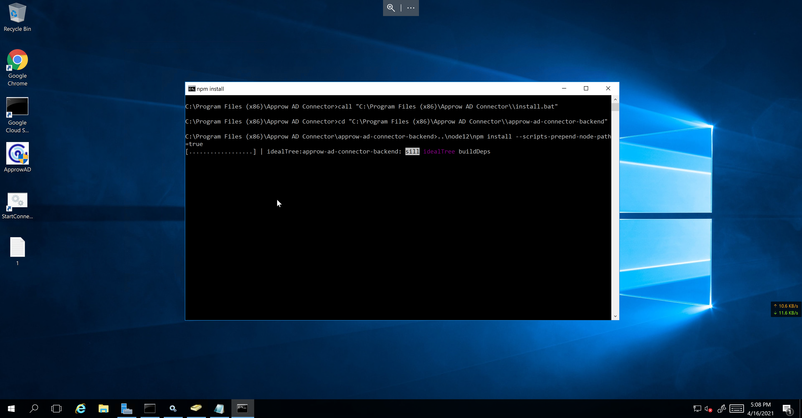
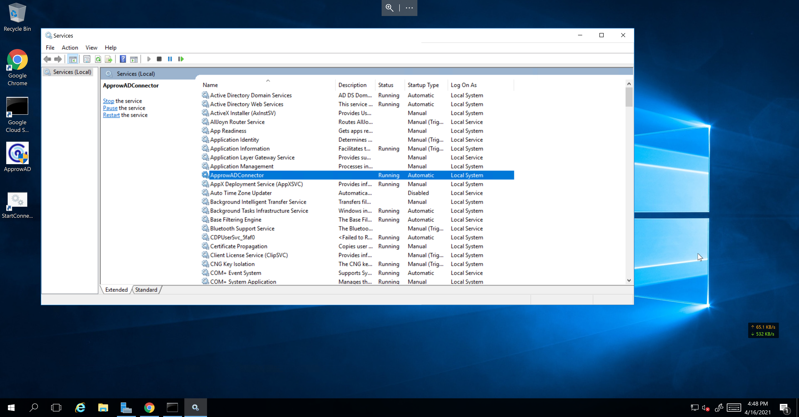
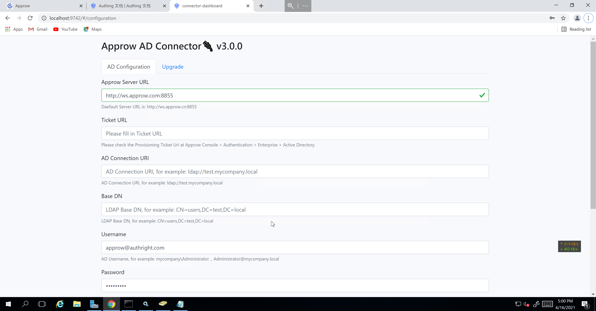
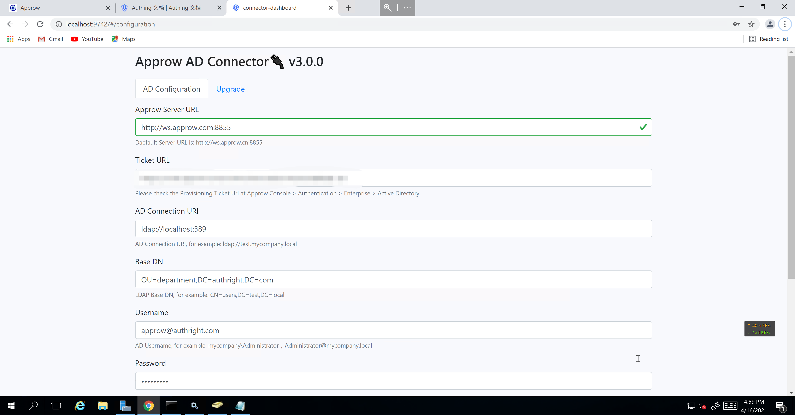
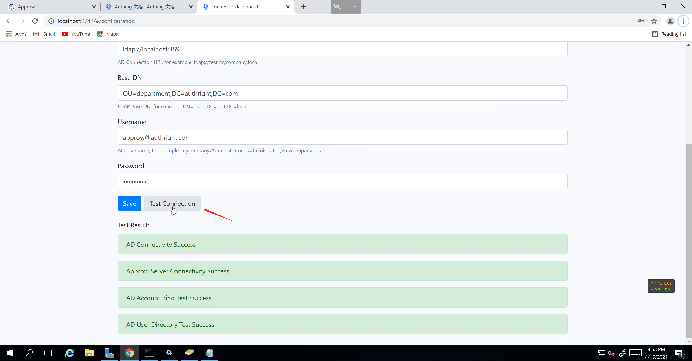

#### Create an AD connection in the {{$localeConfig.brandName}} console

Go to the [{{$localeConfig.brandName}} console](https://console.approw.com/console/userpool) and follow the instructions in the figure below to find **Connect to Identity Source**/**Connect to Active Directory** ：

::: img-description
Create AD connection
:::

You need to enter the following field information:

- **Connection identifier**: This is the only identifier for this connection and cannot be modified after setting.
- **Display Name**: If set, the {{$localeConfig.brandName}} login form will display a "Login with {displayName} button.
- **Application Logo**

Then click the「**Save**」button. After successful creation, you will get a **Provisioning Ticket Url**, which will be used in the following steps:

Then you need to open this AD connection for your application:

#### Run {{$localeConfig.brandName}} AD Connector on Windows

Before installing {{$localeConfig.brandName}}, please make sure that the above conditions are met:

- Windows server;
- Active Directory is installed on the server;
- The machine running {{$localeConfig.brandName}} AD Connector can connect to Active Directory;
- A user account with read permission of Active Directory.

First you need to [download](https://download.authing.cn/app/{{$localeConfig.brandName}}-AD-Connector-latest.exe) {{$localeConfig.brandName}} AD Connector，This is an exe file that needs to run on your Windows AD server and is responsible for communicating with {{$localeConfig.brandName}}. {{$localeConfig.brandName}} AD Connector need to be installed **in the LAN AD domain environment**, but it does not have to be installed on the server running the AD service, as long as {{$localeConfig.brandName}} AD Connector can Go to the AD user directory.

##### Install {{$localeConfig.brandName}} AD Connector

Click [here](https://download.authing.cn/app/{{$localeConfig.brandName}}-AD-Connector-latest.exe)download the latest {{$localeConfig.brandName}} AD Connector.

Upload the downloaded file to the machine in the AD domain environment, and double-click the application to install it.

The system may throw an worning, please click "Still Run this Application".

Click "Next".

Accept all terms in the protocol and click "Next".

Choose the installation path of the software and click "Install".

Wait until the installation process is complete.

Click "Done" and then the command line window will show up. Wait unitl the instiallation process is complete.

There will be some error reports about missing dependents which can be ignored. When you see following window says the installation is complete, you can push any button to quit.

After that you can find ApprowADConnector in the Service Management window of Windows Server.

Open the browser and visit http://127.0.0.1:9742, you will see the following window.

Input your Provisioning Ticket Url, AD Server Connection Address(please use **http://ws.approw.com:8855**), Base DN, Admin User Name and Password. Then click "**Save**" button.

Click "Test Connection", if the following results shows up which means the connection succeed.

::: hint-info
If the connection test failed between Connector and Approw, please wait for a second. That is because the hand shaking between Connector and Approw is not complete caused by network delay.
:::

::: hint-info
If any error shows up about the AD, please check the connection of AD server and if the username/password are correct. 
:::
