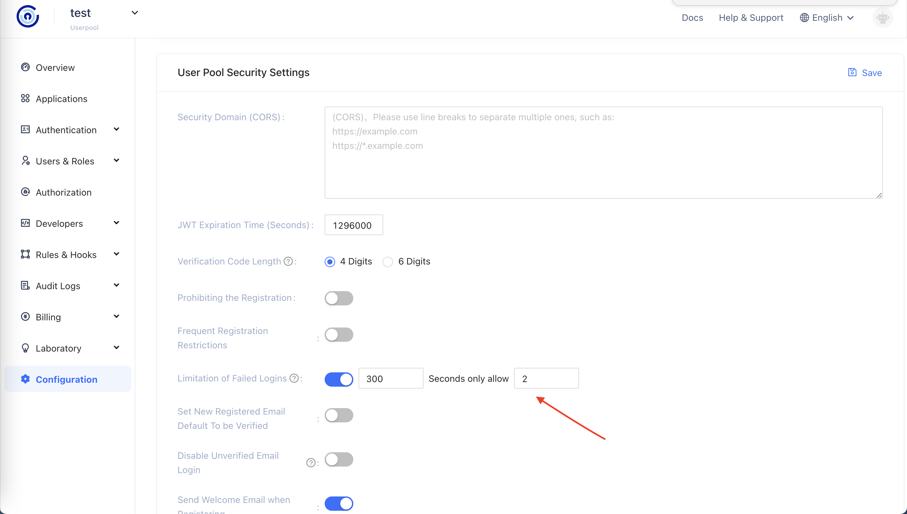
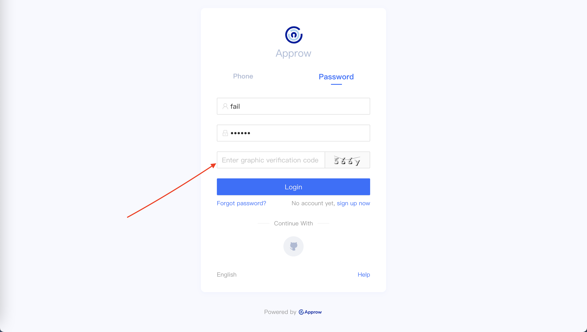

# Configure the Limit of Login Failures

You can enable the limit switch for the number of failed logins in the settings of the console-Security Information to limit the number of failed logins within the same account in seconds:

If the number of times is exceeded within the specified time, the user needs to enter the captcha code to log in again:

