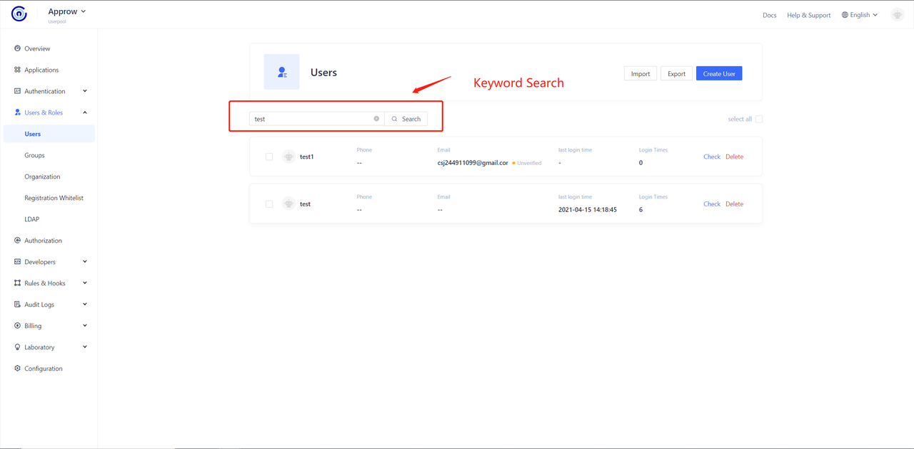

---
meta:
  - name: description
    content: Search for users
---

# Search for users

<LastUpdated/>

Approw supports using fields such as mailbox, user name, mobile phone number, nickname, etc to do the fuzzy search to users in both [console](./search.md) and [SDK](./search.md) modes:

## Search for users using console

You can search for users by keywords on the **user management** -> **user list**:

The fields that support search include email, username, mobile phone number, nickname, etc.

## Search for users using SDK

!!!include(common/sdk-list.md)!!!

You can use the **User Search** method of **UsersManagementClient** in each different language.
